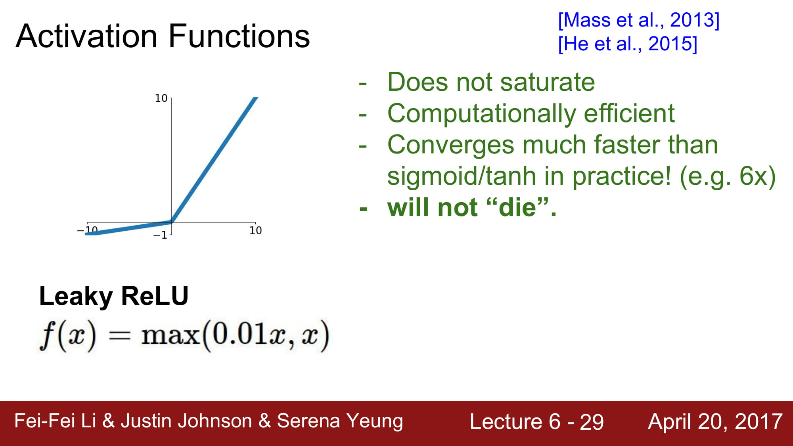
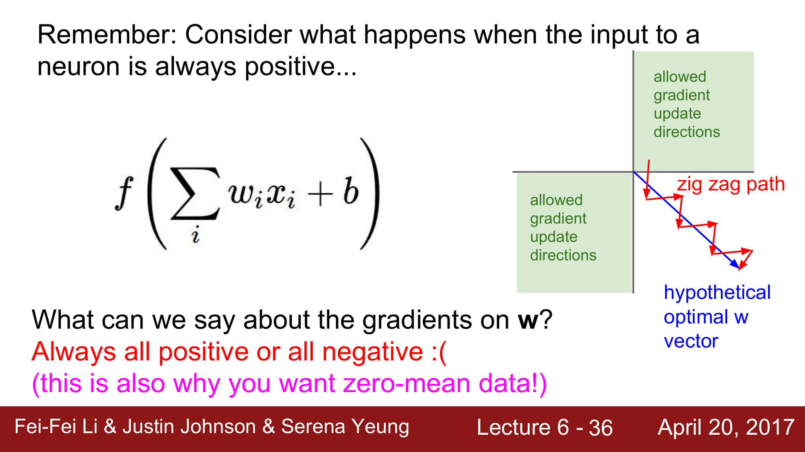
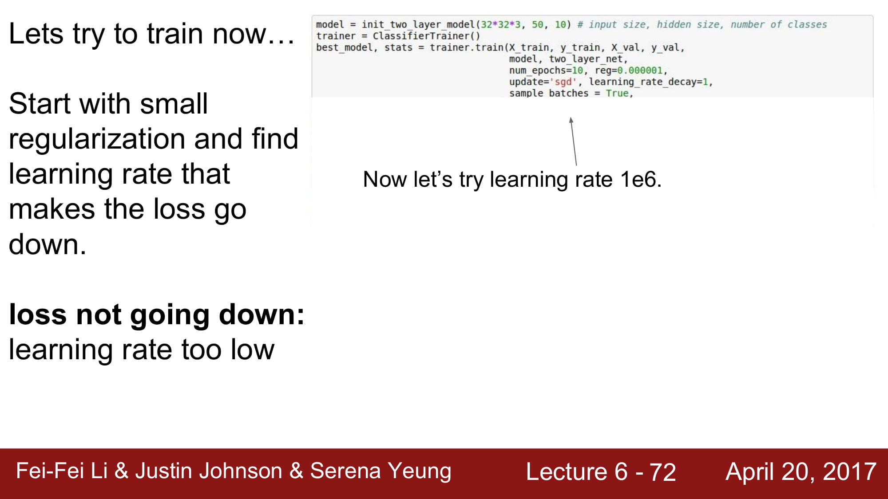

kay, let's get started.
Okay, so today we're going to
get into some of the details
about how we train neural networks.

So, some administrative details first.
Assignment 1 is due today, Thursday,
so 11:59 p.m. tonight on Canvas.
We're also going to be
releasing Assignment 2 today,
and then your project proposals
are due Tuesday, April 25th.
So you should be really starting to think
about your projects now
if you haven't already.

How many people have decided
what they want to do for
their project so far?
Okay, so some, some people,
so yeah, everyone else, you
can go to TA office hours
if you want suggestions
and bounce ideas off of TAs.
We also have a list of projects
that other people have proposed.
Some people usually
affiliated with Stanford,
so on Piazza, so you
can take a look at those
for additional ideas.

And we also have some notes on backprop
for a linear layer and a
vector and tensor derivatives
that Justin's written up,
so that should help with understanding
how exactly backprop works
and for vectors and matrices.
So these are linked to
lecture four on the syllabus
and you can go and take a look at those.

Okay, so where we are now.
We've talked about how
to express a function
in terms of a computational graph,
that we can represent any function
in terms of a computational graph.

And we've talked more explicitly
about neural networks,
which is a type of graph
where we have these linear layers
that we stack on top of each other
with nonlinearities in between.

And we've also talked last lecture
about convolutional neural networks,
which are a particular type of network
that uses convolutional layers
to preserve the spatial structure
throughout all the the
hierarchy of the network.

And so we saw exactly how
a convolution layer looked,
where each activation map
in the convolutional layer output
is produced by sliding a filter of weights
over all of the spatial
locations in the input.

And we also saw that usually
we can have many filters per layer,
each of which produces a
separate activation map.
And so what we can get
is from an input right,
with a certain depth, we'll
get an activation map output,
which has some spatial
dimension that's preserved,
as well as the depth is
the total number of filters
that we have in that layer.
And so what we want to do
is we want to learn the values
of all of these weights or parameters,

and we saw that we can learn
our network parameters
through optimization,
which we talked about little bit earlier
in the course, right?
And so we want to get to a
point in the loss landscape
that produces a low loss,
and we can do this by taking steps
in the direction of the negative gradient.

And so the whole process we actually call
a Mini-batch Stochastic Gradient Descent
where the steps are that we continuously,
we sample a batch of data.
We forward prop it through
our computational graph
or our neural network.
We get the loss at the end.
We backprop through our network
to calculate the gradients.
And then we update the parameters
or the weights in our
network using this gradient.

Okay, so now for the
next couple of lectures
we're going to talk
about some of the details
involved in training neural networks.

And so this involves things like
how do we set up our neural
network at the beginning,
which activation functions that we choose,
how do we preprocess the data,
weight initialization,
regularization, gradient checking.
We'll also talk about training dynamics.
So, how do we babysit
the learning process?
How do we choose how we
do parameter updates,
specific perimeter update rules,
and how do we do
hyperparameter optimization
to choose the best hyperparameters?
And then we'll also talk about evaluation
and model ensembles.

So today in the first part,
I will talk about activation
functions, data preprocessing,
weight initialization,
batch normalization,
babysitting the learning process,
and hyperparameter optimization.

Okay, so first activation functions.

So, we saw earlier how out
of any particular layer,
we have the data coming in.
We multiply by our weight in you know,
fully connected or a convolutional layer.
And then we'll pass this through
an activation function or nonlinearity.

And we saw some examples of this.
We used sigmoid previously
in some of our examples.
We also saw the ReLU nonlinearity.
And so today we'll talk
more about different choices
for these different nonlinearities
and trade-offs between them.

So first, the sigmoid,
which we've seen before,
and probably the one we're
most comfortable with, right?
So the sigmoid function
is as we have up here,
one over one plus e to the negative x.
And what this does is it takes each number
that's input into the sigmoid
nonlinearity, so each element,
and the elementwise squashes these
into this range [0,1] right,
using this function here.
And so, if you get very
high values as input,
then output is going to
be something near one.
If you get very low values,
or, I'm sorry, very negative values,
it's going to be near zero.
And then we have this regime near zero
that it's in a linear regime.
It looks a bit like a linear function.
And so this is been historically popular,
because sigmoids, in a sense,
you can interpret them as a kind of
a saturating firing
rate of a neuron, right?
So if it's something between zero and one,
you could think of it as a firing rate.
And we'll talk later about
other nonlinearities,
like ReLUs that, in practice,
actually turned out to be
more biologically plausible,
but this does have a
kind of interpretation
that you could make.

So if we look at this
nonlinearity more carefully,
there's several problems that
there actually are with this.
So the first is that saturated neurons
can kill off the gradient.
And so what exactly does this mean?

So if we look at a sigmoid gate right,
a node in our computational graph,
and we have our data X as input into it,
and then we have the output
of the sigmoid gate coming out of it,
what does the gradient flow look like
as we're coming back?
We have dL over d sigma right?
The upstream gradient coming down,
and then we're going to
multiply this by dSigma over dX.
This will be the gradient
of a local sigmoid function.
And we're going to chain these together
for our downstream
gradient that we pass back.
So who can tell me what happens
when X is equal to -10?
It's very negative.
What does is gradient look like?
Zero, yeah, so that's right.

So the gradient become zero
and that's because in this negative,
very negative region of the sigmoid,
it's essentially flat,
so the gradient is zero,
and we chain any upstream
gradient coming down.
We multiply by basically
something near zero,
and we're going to get
a very small gradient
that's flowing back downwards, right?
So, in a sense, after the chain rule,
this kills the gradient flow
and you're going to have
a zero gradient passed
down to downstream nodes.
And so what happens
when X is equal to zero?
So there it's, yeah,
it's fine in this regime.
So, in this regime near zero,
you're going to get a
reasonable gradient here,
and then it'll be fine for backprop.
And then what about X equals 10?
Zero, right.
So again, so when X is
equal to a very negative
or X is equal to large positive numbers,
then these are all regions where
the sigmoid function is flat,
and it's going to kill off the gradient
and you're not going to get
a gradient flow coming back.

Okay, so a second problem is that
the sigmoid outputs are not zero centered.
And so let's take a look
at why this is a problem.

So, consider what happens when
the input to a neuron is always positive.
So in this case, all of our Xs
we're going to say is positive.
It's going to be multiplied
by some weight, W,
and then we're going to run it
through our activation function.
So what can we say about
the gradients on W?
So think about what the local
gradient is going to be,
right, for this linear layer.
We have DL over whatever
the activation function,
the loss coming down,
and then we have our local gradient,
which is going to be basically X, right?
And so what does this mean,
if all of X is positive?

Okay, so I heard it's
always going to be positive.
So that's almost right.
It's always going to be either positive,
or all positive or all negative, right?
So, our upstream gradient coming down
is DL over our loss.
L is going to be DL over DF.
and this is going to be
either positive or negative.
It's some arbitrary gradient coming down.
And then our local gradient
that we multiply this by is,
if we're going to find the gradients on W,
is going to be DF over DW,
which is going to be X.
And if X is always positive
then the gradients on W,
which is multiplying these two together,
are going to always be
the sign of the upstream
gradient coming down.
And so what this means is
that all the gradients of W,
since they're always either
positive or negative,
they're always going to
move in the same direction.
You're either going to
increase all of the,
when you do a parameter update,
you're going to either
increase all of the values of W
by a positive amount, or
differing positive amounts,
or you will decrease them all.
And so the problem with this is that,
this gives very inefficient
gradient updates.
So, if you look at on the right here,
we have an example of a case where,
let's say W is two-dimensional,
so we have our two axes for W,
and if we say that we can only have
all positive or all negative updates,
then we have these two quadrants,
and, are the two places where the axis
are either all positive or negative,
and these are the only directions in which
we're allowed to make a gradient update.
And so in the case where,
let's say our hypothetical optimal W
is actually this blue vector here, right,
and we're starting off
at you know some point,
or at the top of the the the
beginning of the red arrows,
we can't just directly take
a gradient update in this direction,
because this is not in one of those
two allowed gradient directions.
And so what we're going to have to do,
is we'll have to take a
sequence of gradient updates.
For example, in these red arrow directions
that are each in allowed directions,
in order to finally get to this optimal W.
And so this is why also, in general,
we want a zero mean data.
So, we want our input X to be zero meaned,
so that we actually have
positive and negative values
and we don't get into this problem
of the gradient updates.
They'll be all moving
in the same direction.
So is this clear?
Any questions on this point?

Okay.
Okay, so we've talked about these two
main problems of the sigmoid.
The saturated neurons
can kill the gradients
if we're too positive or
too negative of an input.
They're also not zero-centered
and so we get these,
this inefficient kind of gradient update.
And then a third problem,
we have an exponential function in here,
so this is a little bit
computationally expensive.
In the grand scheme of your network,
this is usually not the main problem,
because we have all these convolutions
and dot products that
are a lot more expensive,
but this is just a minor
point also to observe.

So now we can look at a second
activation function here at tanh.
And so this looks very
similar to the sigmoid,
but the difference is that now
it's squashing to the range [-1, 1].
So here, the main difference
is that it's now zero-centered,
so we've gotten rid of the
second problem that we had.
It still kills the gradients,
however, when it's saturated.
So, you still have these regimes
where the gradient is essentially flat
and you're going to
kill the gradient flow.
So this is a bit better than the sigmoid,
but it still has some problems.

Okay, so now let's look at
the ReLU activation function.
And this is one that we saw
in our examples last lecture
when we were talking about
the convolutional neural network.
And we saw that we interspersed
ReLU nonlinearities
between many of the convolutional layers.
And so, this function is f of
x equals max of zero and x.
So it takes an elementwise
operation on your input
and basically if your input is negative,
it's going to put it to zero.
And then if it's positive,
it's going to be just passed through.
It's the identity.
And so this is one that's
pretty commonly used,
and if we look at this one
and look at and think about the problems
that we saw earlier with
the sigmoid and the tanh,
we can see that it doesn't saturate
in the positive region.
So there's whole half of our input space
where it's not going to saturate,
so this is a big advantage.
So this is also
computationally very efficient.
We saw earlier that the sigmoid
has this E exponential in it.
And so the ReLU is just this simple max
and there's, it's extremely fast.
And in practice, using this ReLU,
it converges much faster than
the sigmoid and the tanh,
so about six times faster.
And it's also turned out to be more
biologically plausible than the sigmoid.
So if you look at a neuron
and you look at what the inputs look like,
and you look at what
the outputs look like,
and you try to measure this
in neuroscience experiments,
you'll see that this one
is actually a closer approximation
to what's happening than sigmoids.
And so ReLUs were starting to be used
a lot around 2012 when we had AlexNet,
the first major
convolutional neural network
that was able to do well
on ImageNet and large-scale data.
They used the ReLU in their experiments.

So a problem however, with the ReLU,
is that it's still, it's not
not zero-centered anymore.
So we saw that the sigmoid
was not zero-centered.
Tanh fixed this and now
ReLU has this problem again.
And so that's one of
the issues of the ReLU.
And then we also have
this further annoyance of,
again we saw that in the
positive half of the inputs,
we don't have saturation,
but this is not the case
of the negative half.

Right, so just thinking about this
a little bit more precisely.
So what's happening here
when X equals negative 10?
So zero gradient, that's right.
What happens when X is
equal to positive 10?
It's good, right.
So, we're in the linear regime.
And then what happens
when X is equal to zero?
Yes, it undefined here,
but in practice, we'll
say, you know, zero, right.
And so basically, it's
killing the gradient
in half of the regime.

And so we can get this phenomenon
of basically dead ReLUs,
when we're in this bad part of the regime.
And so there's, you can look at this in,
as coming from several potential reasons.
And so if we look at our data cloud here,
this is all of our training data,
then if we look at where
the ReLUs can fall,
so the ReLUs can be,
each of these is basically
the half of the plane where
it's going to activate.
And so each of these is the plane
that defines each of these ReLUs,
and we can see that you
can have these dead ReLUs
that are basically off of the data cloud.
And in this case, it will never
activate and never update,
as compared to an active ReLU
where some of the data
is going to be positive and passed through
and some won't be.
And so there's several reasons for this.
The first is that it can happen
when you have bad initialization.
So if you have weights
that happen to be unlucky
and they happen to be off the data cloud,
so they happen to specify
this bad ReLU over here.
Then they're never going to get
a data input that causes it to activate,
and so they're never going to get
good gradient flow coming back.
And so it'll just never
update and never activate.
What's the more common case is
when your learning rate is too high.
And so this case you started
off with an okay ReLU,
but because you're making
these huge updates,
the weights jump around
and then your ReLU unit in a sense,
gets knocked off of the data manifold.
And so this happens through training.
So it was fine at the beginning
and then at some point,
it became bad and it died.
And so if in practice,
if you freeze a network
that you've trained
and you pass the data through,
you can see it actually
is much as 10 to 20%
of the network is these dead ReLUs.
And so you know that's a problem,
but also most networks do have
this type of problem when you use ReLUs.
Some of them will be dead,
and in practice, people look into this,
and it's a research problem,
but it's still doing okay
for training networks.

Yeah, is there a question?
[student speaking off mic]
Right.
So the question is, yeah,
so the data cloud is
just your training data.
[student speaking off mic]
Okay, so the question is when,
how do you tell when the ReLU
is going to be dead or not,
with respect to the data cloud?
And so if you look at,
this is an example of like a
simple two-dimensional case.
And so our ReLU, we're going
to get our input to the ReLU,
which is going to be a basically you know,
so that that defines this this
separating hyperplane here,
and then we're going to take half of it
that's going to be positive,
and half of it's going to be killed off,
and so yes, so you, you know you just,
it's whatever the weights happened to be,
and where the data happens
to be is where these,
where these hyperplanes fall, and so,
so yeah so just throughout
the course of training,
some of your ReLUs will
be in different places,
with respect to the data cloud.

Oh, question.
[student speaking off mic]
Yeah.
So okay, so the question is
for the sigmoid we talked
about two drawbacks,
and one of them was that the
neurons can get saturated,
so let's go back to the sigmoid here,

and the question was this is not the case,
when all of your inputs are positive.
So when all of your inputs are positive,
they're all going to be coming in
in this zero plus region here,
and so you can still
get a saturating neuron,
because you see up in
this positive region,
it also plateaus at one,
and so when it's when you
have large positive values
as input you're also going
to get the zero gradient,
because you have you
have a flat slope here.
Okay.
And so we can get this phenomenon
of basically dead ReLUs,
when we're in this bad part of the regime.
And so there's, you can look at this in,
as coming from several potential reasons.
And so if we look at our data cloud here,
this is all of our training data,
then if we look at where
the ReLUs can fall,
so the ReLUs can be,

Okay, so in practice people
also like to initialize ReLUs
with slightly positive biases,
in order to increase the
likelihood of it being
active at initialization
and to get some updates.
Right and so this basically
just biases towards more ReLUs
firing at the beginning,
and in practice some say that it helps.
Some say that it doesn't.
Generally people don't always use this.
It's yeah, a lot of times
people just initialize it
with zero biases still.

Okay, so now we can look
at some modifications
on the ReLU that have come out since then,
and so one example is this leaky ReLU.
And so this looks very
similar to the original ReLU,
and the only difference is
that now instead of being flat
in the negative regime,
we're going to give a
slight negative slope here
And so this solves a lot of the problems
that we mentioned earlier.
Right here we don't have
any saturating regime,
even in the negative space.
It's still very computationally efficient.
It still converges faster
than sigmoid and tanh,
very similar to a ReLU.
And it doesn't have this dying problem.

And there's also another example
is the parametric rectifier, so PReLU.
And so in this case it's
just like a leaky ReLU
where we again have this sloped region
in the negative space,
but now this slope in the negative regime
is determined through
this alpha parameter,
so we don't specify,
we don't hard-code it.
but we treat it as now a parameter
that we can backprop into and learn.
And so this gives it a
little bit more flexibility.

And we also have something called
an Exponential Linear Unit, an ELU,
so we have all these
different LUs, basically.
and this one again, you know,
it has all the benefits of the ReLu,
but now you're, it is also
closer to zero mean outputs.
So, that's actually an
advantage that the leaky ReLU,
parametric ReLU, a lot
of these they allow you
to have your mean closer to zero,
but compared with the leaky ReLU,
instead of it being sloped
in the negative regime,
here you actually are building back
in a negative saturation regime,
and there's arguments that
basically this allows you
to have some more robustness to noise,
and you basically get
these deactivation states
that can be more robust.
And you can look at this paper for,
there's a lot of kind
of more justification
for why this is the case.
And in a sense this is kind of something
in between the ReLUs and the leaky ReLUs,
where has some of this shape,
which the Leaky ReLU does,
which gives it closer to zero mean output,
but then it also still has some of this
more saturating behavior that ReLUs have.
A question?
[student speaking off mic]
So, whether this parameter alpha
is going to be specific for each neuron.
So, I believe it is often specified,
but I actually can't remember exactly,
so you can look in the paper for exactly,
yeah, how this is defined,
but yeah, so I believe
this function is basically
very carefully designed in order to have
nice desirable properties.
Okay, so there's basically all of these
kinds of variants on the ReLU.
And so you can see that,
all of these it's kind of,
you can argue that each one
may have certain benefits,
certain drawbacks in practice.
People just want to run
experiments all of them,
and see empirically what works better,
try and justify it, and
come up with new ones,
but they're all different things
that are being experimented with.

And so let's just mention one more.
This is Maxout Neuron.
So, this one looks a little bit different
in that it doesn't have the
same form as the others did
of taking your basic dot product,
and then putting this element-wise
nonlinearity in front of it.
Instead, it looks like this,
this max of W dot product of X plus B,
and a second set of weights,
And so what does this,
is this is taking the max
of these two functions in a sense.
And so what it does is
it generalizes the ReLU
and the leaky ReLu,
because you're just you're
taking the max over these two,
two linear functions.
And so what this give us,
it's again you're operating
in a linear regime.
It doesn't saturate and it doesn't die.
The problem is that here,
you are doubling the number
of parameters per neuron.
So, each neuron now has this
original set of weights, W,
but it now has W1 and W2,
so you have twice these.

So in practice,
when we look at all of
these activation functions,
kind of a good general
rule of thumb is use ReLU.
This is the most standard one
that generally just works well.
And you know you do want
to be careful in general
with your learning rates
to adjust them based,
see how things do.
We'll talk more about
adjusting learning rates
later in this lecture,
but you can also try out some of these
fancier activation functions,
the leaky ReLU, Maxout, ELU,
but these are generally,
they're still kind of more experimental.
So, you can see how they
work for your problem.
You can also try out tanh,
but probably some of these ReLU
and ReLU variants are going to be better.
And in general don't use sigmoid.
This is one of the earliest
original activation functions,
and ReLU and these other variants
have generally worked better since then.

Okay, so now let's talk a little bit
about data preprocessing.
Right, so the activation function,
we design this is part of our network.
Now we want to train the network,
and we have our input data
that we want to start training from.

So, generally we want to
always preprocess the data,
and this is something that
you've probably seen before
in machine learning
classes if you taken those.
And some standard types
of preprocessing are,
you take your original data
and you want to zero mean them,
and then you probably want
to also normalize that,
so normalized by the standard deviation,

And so why do we want to do this?
For zero centering, you
can remember earlier
that we talked about when all the inputs
are positive, for example,
then we get all of our gradients
on the weights to be positive,
and we get this basically
suboptimal optimization.
And in general even if it's
not all zero or all negative,
any sort of bias will still
cause this type of problem.

And so then in terms of
normalizing the data,
this is basically you
want to normalize data
typically in the machine
learning problems,
so that all features
are in the same range,
and so that they contribute equally.
In practice, since for
images, which is what
we're dealing with in this
course here for the most part,
we do do the zero centering,
but in practice we
don't actually normalize
the pixel value so much,
because generally for images
right at each location you already have
relatively comparable
scale and distribution,
and so we don't really
need to normalize so much,
compared to more general
machine learning problems,
where you might have different features
that are very different and
of very different scales.

And in machine learning,
you might also see a
more complicated things,
like PCA or whitening,
but again with images,
we typically just stick
with the zero mean,
and we don't do the normalization,
and we also don't do some of these
more complicated pre-processing.
And one reason for this
is generally with images
we don't really want to
take all of our input,
let's say pixel values and project this
onto a lower dimensional space
of new kinds of features
that we're dealing with.
We typically just want to apply
convolutional networks spatially
and have our spatial structure
over the original image.
Yeah, question.
[student speaking off mic]
So the question is we
do this pre-processing
in a training phase,
do we also do the same kind
of thing in the test phase,
and the answer is yes.
So, let me just move
to the next slide here.
So, in general on the training phase
is where we determine our let's say, mean,
and then we apply this exact
same mean to the test data.
So, we'll normalize by the same
empirical mean from the training data.

Okay, so to summarize
basically for images,
we typically just do the
zero mean pre-processing
and we can subtract either
the entire mean image.
So, from the training data,
you compute the mean image,
which will be the same size
as your, as each image.
So, for example 32 by 32 by three,
you'll get this array of numbers,
and then you subtract that from each image
that you're about to
pass through the network,
and you'll do the same thing at test time
for this array that you
determined at training time.
In practice, we can
also for some networks,
we also do this by just of subtracting
a per-channel mean,
and so instead of having
an entire mean image
that were going to zero-center by,
we just take the mean by channel,
and this is just because it turns out that
it was similar enough
across the whole image,
it didn't make such a big difference
to subtract the mean image
versus just a per-channel value.
And this is easier to just
pass around and deal with.
So, you'll see this as well
for example, in a VGG Network,
which is a network that
came after AlexNet,
and we'll talk about that later.
Question.
[student speaking off mic]
Okay, so there are two questions.
The first is what's a
channel, in this case,
when we are subtracting
a per-channel mean?
And this is RGB, so our array,
our images are typically for
example, 32 by 32 by three.
So, width, height, each are 32,
and our depth, we have three channels RGB,
and so we'll have one
mean for the red channel,
one mean for a green, one for blue.
And then the second, what
was your second question?
[student speaking off mic]
Oh.
Okay, so the question is when
we're subtracting the mean image,
what is the mean taken over?
And the mean is taking over
all of your training images.
So, you'll take all of
your training images
and just compute the mean of all of those.
Does that make sense?
[student speaking off mic]
Yeah the question is,
we do this for the entire training set,
once before we start training.
We don't do this per batch,
and yeah, that's exactly correct.
So we just want to have a good sample,
an empirical mean that we have.
And so if you take it per batch,
if you're sampling reasonable batches,
it should be basically,
you should be getting
the same values anyways for the mean,
and so it's more efficient and easier
just do this once at the beginning.
You might not even have to really take it
over the entire training data.
You could also just sample
enough training images
to get a good estimate of your mean.
Okay, so any other questions
about data preprocessing?
Yes.
[student speaking off mic]
So, the question is does
the data preprocessing
solve the sigmoid problem?
So the data preprocessing
is doing zero mean right?
And we talked about how sigmoid,
we want to have zero mean.
And so it does solve
this for the first layer
that we pass it through.
So, now our inputs to the first layer
of our network is going to be zero mean,
but we'll see later on that
we're actually going to have
this problem come up in
much worse and greater form,
as we have deep networks.
You're going to get a lot
of nonzero mean problems later on.
And so in this case, this is
not going to be sufficient.
So this only helps at the
first layer of your network.

Okay, so now let's talk
about how do we want
to initialize the weights of our network?

So, we have let's say
our standard two layer neural network
and we have all of these
weights that we want to learn,
but we have to start them
with some value, right?
And then we're going to update them
using our gradient updates from there.
So first question.
What happens when we use
an initialization of W equals zero?
We just set all of the
parameters to be zero.
What's the problem with this?
[student speaking off mic]
So sorry, say that again.
So I heard all the neurons
are going to be dead.
No updates ever.
So not exactly.
So, part of that is correct in that
all the neurons will do the same thing.
So, they might not all be dead.
Depending on your input value, I mean,
you could be in any
regime of your neurons,
so they might not be dead,
but the key thing is that they
will all do the same thing.
So, since your weights are zero,
given an input, every
neuron is going to be,
have the same operation
basically on top of your inputs.
And so, since they're all
going to output the same thing,
they're also all going
to get the same gradient.
And so, because of that,
they're all going to
update in the same way.
And now you're just going to get
all neurons that are exactly the same,
which is not what you want.
You want the neurons to
learn different things.
And so, that's the problem
when you initialize everything equally
and there's basically no
symmetry breaking here.

So, what's the first, yeah question?
[student speaking off mic]
So the question is, because that,
because the gradient
also depends on our loss,
won't one backprop differently
compared to the other?
So in the last layer, like yes,
you do have basically some of this,
the gradients will get the same,
sorry, will get different
loss for each specific neuron
based on which class it was connected to,
but if you look at all the neurons
generally throughout your
network, like you're going to,
you basically have a lot of these neurons
that are connected in
exactly the same way.
They had the same updates
and it's basically
going to be the problem.

Okay, so the first idea that we can have
to try and improve upon this
is to set all of the weights
to be small random numbers
that we can sample from a distribution.
So, in this case, we're
going to sample from
basically a standard gaussian,
but we're going to scale it
so that the standard deviation
is actually one E negative two, 0.01.

And so, just give this
many small random weights.
And so, this does work
okay for small networks,
now we've broken the symmetry,
but there's going to be
problems with deeper networks.

And so, let's take a look
at why this is the case.
So, here this is basically
an experiment that we can do
where let's take a deeper network.
So in this case, let's initialize
a 10 layer neural network
to have 500 neurons in
each of these 10 layers.
Okay, we'll use tanh
nonlinearities in this case
and we'll initialize it
with small random numbers
as we described in the last slide.
So here, we're going to basically
just initialize this network.
We have random data
that we're going to take,
and now let's just pass it
through the entire network,
and at each layer, look at the statistics
of the activations that
come out of that layer.

And so, what we'll see this is probably
a little bit hard to read up top,
but if we compute the mean
and the standard deviations at each layer,
well see that at the first layer this is,
the means are always around zero.
There's a funny sound in here.
Interesting, okay well that was fixed.
So, if we look at, if we look
at the outputs from here,
the mean is always
going to be around zero,
which makes sense.

So, if we look here, let's see,
if we take this, we looked at
the dot product of X with W,
and then we took the tanh on linearity,

and then we store these values and so,
because it tanh is centered around zero,
this will make sense,
and then the standard
deviation however shrinks,
and it quickly collapses to zero.
So, if we're plotting this,
here this second row of plots here
is showing the mean
and standard deviations
over time per layer
and then in the bottom,
the sequence of plots is
showing for each of our layers.
What's the distribution of
the activations that we have?
And so, we can see that
at the first layer,
we still have a reasonable
gaussian looking thing.
It's a nice distribution.
But the problem is that as we multiply
by this W, these small numbers at each layer,
this quickly shrinks and
collapses all of these values,
as we multiply this over and over again.
And so, by the end, we
get all of these zeros,
which is not what we want.

So we get all the activations become zero.
And so now let's think
about the backwards pass.
So, if we do a backward pass,
now assuming this was our forward pass
and now we want to compute our gradients.
So first, what does the gradients
look like on the weights?
Does anyone have a guess?
So, if we think about this,
we have our input values are very small
at each layer right,
because they've all
collapsed at this near zero,
and then now each layer,
we have our upstream
gradient flowing down,
and then in order to get
the gradient on the weights
remember it's our upstream gradient
times our local gradient,
which for this this dot
product were doing W times X.
It's just basically going to
be X, which is our inputs.
So, it's again a similar kind of problem
that we saw earlier,
where now since, so
here because X is small,
our weights are getting
a very small gradient,
and they're basically not updating.
So, this is a way that you can
basically try and think about
the effect of gradient
flows through your networks.
You can always think about
what the forward pass is doing,
and then think about what's happening
as you have gradient flows coming down,
and different types of inputs,
what the effect of this
actually is on our weights
and the gradients on them.
And so also, if now if we think about
what's the gradient that's
going to be flowing back
from each layer as we're
chaining all these gradients.
Alright, so this is going to be
the flip thing where we have now
the gradient flowing back
is our upstream gradient
times in this case the local
gradient is W on our input X.
And so again, because
this is the dot product,
and so now, actually going
backwards at each layer,
we're basically doing a multiplication
of the upstream gradient by our weights
in order to get the next
gradient flowing downwards.
And so because here,
we're multiplying by
W over and over again.
You're getting basically
the same phenomenon
as we had in the forward pass
where everything is getting
smaller and smaller.
And now the gradient, upstream gradients
are collapsing to zero as well.

Question?
[student speaking off mic]
Yes, I guess upstream and downstream is,
can be interpreted differently,
depending on if you're
going forward and backward,
but in this case we're going, we're doing,
we're going backwards, right?
We're doing back propagation.
And so upstream is the gradient flowing,
you can think of a flow from your loss,
all the way back to your input.
And so upstream is what came
from what you've already done,
flowing you know, down
into your current node.
Right, so we're for flowing downwards,
and what we get coming into
the node through backprop
is coming from upstream.

Okay, so now let's think
about what happens when,
you know we saw that this was a problem
when our weights were pretty small, right?
So, we can think about well,
what if we just try and solve this
by making our weights big?
So, let's sample from
this standard gaussian,
now with standard deviation one instead of 0.01.
So what's the problem here?
Does anyone have a guess?
If our weights are now all
big, and we're passing them,
and we're taking these
outputs of W times X,
and passing them through
tanh nonlinearities,
remember we were talking
about what happens
at different values of inputs to tanh,
so what's the problem?
Okay, so yeah I heard that
it's going to be saturated,
so that's right.
Basically now, because our
weights are going to be big,
we're going to always
be at saturated regimes
of either very negative or
very positive of the tanh.
And so in practice, what
you're going to get here
is now if we look at the
distribution of the activations
at each of the layers here on the bottom,
they're going to be all basically
negative one or plus one.
Right, and so this will have the problem
that we talked about
with the tanh earlier,
when they're saturated,
that all the gradients will be zero,
and our weights are not updating.

So basically, it's really hard to get
your weight initialization right.
When it's too small they all collapse.
When it's too large they saturate.
So, there's been some work
in trying to figure out
well, what's the proper way
to initialize these weights.
And so, one kind of good rule
of thumb that you can use
is the Xavier initialization.
And so this is from this
paper by Glorot in 2010.
And so what this formula is,
is if we look at W up here,
we can see that we want to
initialize them to these,
we sample from our standard gaussian,
and then we're going to scale
by the number of inputs that we have.
And you can go through the math,
and you can see in the lecture notes
as well as in this paper
of exactly how this works out,
but basically the way
we do it is we specify
that we want the variance of the input
to be the same as a
variance of the output,
and then if you derive
what the weight should be
you'll get this formula,
and intuitively with this
kind of means is that
if you have a small
number of inputs right,
then we're going to divide
by the smaller number
and get larger weights,
and we need larger weights,
because with small inputs,
and you're multiplying
each of these by weight,
you need a larger weights
to get the same larger variance at output,
and kind of vice versa for
if we have many inputs,
then we want smaller
weights in order to get
the same spread at the output.
So, you can look at the notes
for more details about this.
And so basically now, if we
want to have a unit gaussian,
right as input to each layer,
we can use this kind of initialization to
at training time, to be
able to initialize this,
so that there is approximately
a unit gaussian at each layer.
Okay, and so one thing
is does assume though
is that it is assumed that
there's linear activations.
and so it assumes that
we are in the activation,
in the active region of
the tanh, for example.
And so again, you can look at the notes
to really try and
understand its derivation,

but the problem is that this breaks
when now you use something like a ReLU.
Right, and so with the
ReLU what happens is that,
because it's killing half of your units,
it's setting approximately half of them
to zero at each time,
it's actually halving the
variance that you get out of this.
And so now, if you just
make the same assumptions
as your derivation
earlier you won't actually
get the right variance coming out,
it's going to be too small.
And so what you see is again
this kind of phenomenon,
as the distributions starts collapsing.
In this case you get more
and more peaked toward zero,
and more units deactivated.

And the way to address this
with something that has been
pointed out in some papers,
which is that you can you
can try to account for this
with an extra, divided by two.
So, now you're basically
adjusting for the fact
that half the neurons get killed.
And so you're kind of equivalent input
has actually half this number of input,
and so you just add this
divided by two factor in,
this works much better,
and you can see that the
distributions are pretty good
throughout all layers of the network.

And so in practice this is
been really important actually,
for training these types of little things,
to a really pay attention
to how your weights are,
make a big difference.
And so for example,
you'll see in some papers
that this actually is the
difference between the network
even training at all and performing well
versus nothing happening.

So, proper initialization is still
an active area of research.
And so if you're interested in this,
you can look at a lot of
these papers and resources.
A good general rule of thumb is basically
use the Xavier
Initialization to start with,
and then you can also think about
some of these other kinds of methods.

And so now we're going to talk
about a related idea to this,
so this idea of wanting
to keep activations
in a gaussian range that we want.
Right, and so this idea behind

what we're going to call
batch normalization is,
okay we want unit gaussian activations.
Let's just make them that way.
Let's just force them to be that way.
And so how does this work?
So, let's consider a batch
of activations at some layer.
And so now we have all of
our activations coming out.
If we want to make this unit gaussian,
we actually can just do
this empirically, right.
We can take the mean of the
batch that we have so far
of the current batch, and we
can just and the variance,
and we can just normalize by this.
Right, and so basically,
instead of with weight initialization,
we're setting this at
the start of training
so that we try and get it into a good spot
that we can have unit
gaussians at every layer,
and hopefully during training
this will preserve this.
Now we're going to
explicitly make that happen
on every forward pass through the network.
We're going to make this
happen functionally,
and basically by normalizing by the mean
and the variance of each neuron,
we look at all of the
inputs coming into it
and calculate the mean and
variance for that batch
and normalize it by it.
And the thing is that this is a,
this is just a differentiable
function right?
If we have our mean and
our variance as constants,
this is just a sequence of
computational operations
that we can differentiate and
do back prop through this.

Okay, so just as I was
saying earlier right,
if we look at our input
data, and we think of this as
we have N training examples
in our current batch,
and then each batch has dimension D,
we're going to the
compute the empirical mean
and variance independently
for each dimension,
so each basically feature element,
and we compute this across our batch,
our current mini-batch that we have
and we normalize by this.

And so this is usually
inserted after fully connected
or convolutional layers.
We saw that would we were multiplying
by W in these layers, which
we do over and over again,
then we can have this bad
scaling effect with each one.
And so this basically is
able to undo this effect.
Right, and since we're basically
just scaling by the inputs
connected to each neuron, each activation,
we can apply this the same
way to fully connected
convolutional layers, and
the only difference is that,
with convolutional layers,
we want to normalize
not just across all the training examples,
and independently for each
each feature dimension,
but we actually want to normalize jointly
across both all the feature dimensions,
all the spatial locations
that we have in our activation map,
as well as all of the training examples.
And we do this,
because we want to obey
the convolutional property,
and we want nearby locations
to be normalized the same way, right?
And so with a convolutional layer,
we're basically going to have a one mean
and one standard deviation,
per activation map that that we have,
and we're going to normalize by this
across all of the examples in the batch.
And so this is something that you guys
are going to implement
in your next homework.
And so, all of these details
are explained very clearly
in this paper from 2015.
And so on this is a very useful,
useful technique that you
want to use a lot in practice.
You want to have these
batch normalization layers.
And so you should read this paper.
Go through all of the derivations,
and then also go through the derivations
of how to compute the
gradients with given these,
this normalization operation.

Okay, so one thing that I just
want to point out is that,
it's not clear that, you know,
we're doing this batch normalization
after every fully connected layer,
and it's not clear that
we necessarily want
a unit gaussian input to
these tanh nonlinearities,
because what this is doing
is this is constraining you
to the linear regime of this nonlinearity,
and we're not actually, you're
trying to basically say,
let's not have any of this saturation,
but maybe a little bit
of this is good, right?
You you want to be able to control what's,
how much saturation that you want to have.

And so what, the way that we address this
when we're doing batch normalization
is that we have our normalization operation,
but then after that we
have this additional
squashing and scaling operation.
So, we do our normalization.
Then we're going to scale
by some constant gamma,
and then shift by another factor of beta.
Right, and so what this
actually does is that
this allows you to be able to
recover the identity function
if you wanted to.
So, if the network wanted to,
it could learn your scaling factor gamma
to be just your variance.
It could learn your beta to be your mean,
and in this case you can
recover the identity mapping,
as if you didn't have batch normalization.
And so now you have the flexibility
of doing kind of everything in between
and making your the network learning
how to make your tanh
more or less saturated,
and how much to do so in order to have,
to have good training.

Okay, so just to sort of summarize
the batch normalization idea.
Right, so given our inputs,
we're going to compute
our mini-batch mean.
So, we do this for every
mini-batch that's coming in.
We compute our variance.
We normalize by the mean and variance,
and we have this additional
scaling and shifting factor.
And so this improves gradient
flow through the network.
it's also more robust as a result.
It works for more range of learning rates,
and different kinds of initialization,
so people have seen that
once you put batch normalization in,
and it's just easier to train,
and so that's why you should do this.
And then also when one thing
that I just want to point out
is that you can also
think of this as in a way
also doing some regularization.
Right and so, because now
at the output of each layer,
each of these activations,
each of these outputs,
is an output of both your input X,
as well as the other examples in the batch
that it happens to be sampled with, right,
because you're going to
normalize each input data
by the empirical mean over that batch.
So because of that,
it's no longer producing
deterministic values for
a given training example,
and it's tying all of these
inputs in a batch together.
And so this basically, because
it's no longer deterministic,
kind of jitters your
representation of X a little bit,
and in a sense, gives some
sort of regularization effect.

Yeah, question?
[student speaking off camera]
The question is gamma and
beta are learned parameters,
and yes that's the case.
[student speaking off mic]
Yeah, so the question is
why do we want to learn
this gamma and beta to be able
to learn the identity function back,
and the reason is because
you want to give it the flexibility.
Right, so what batch
normalization is doing,
is it's forcing our data to
become this unit gaussian,
our inputs to be unit gaussian,
but even though in general
this is a good idea,
it's not always that this is
exactly the best thing to do.
And we saw in particular
for something like a tanh,
you might want to control
some degree of saturation that you have.
And so what this does is it
gives you the flexibility
of doing this exact like
unit gaussian normalization,
if it wants to, but
also learning that maybe
in this particular part of the network,
maybe that's not the best thing to do.
Maybe we want something
still in this general idea,
but slightly different right,
slightly scaled or shifted.
And so these parameters just
give it that extra flexibility
to learn that if it wants to.
And then yeah, if the the best thing to do
is just batch normalization
then it'll learn
the right parameters for that.

Yeah?
[student speaking off mic]
Yeah, so basically each neuron output.
So, we have output of a
fully connected layer.
We have W times X.
and so we have the values
of each of these outputs,
and then we're going to apply
batch normalization separately
to each of these neurons.

Question?
[student speaking off mic]
Yeah, so the question is that
for things like reinforcement learning,
you might have a really small batch size.
How do you deal with this?
So in practice, I guess batch
normalization has been used
a lot for like for standard
convolutional neural networks,
and there's actually papers
on how do we want to do
normalization for different
kinds of recurrent networks,
or you know some of these networks
that might also be in
reinforcement learning.
And so there's different considerations
that you might want to think of there.
And this is still an
active area of research.
There's papers on this and we might also
talk about some of this more later,
but for a typical
convolutional neural network
this generally works fine.
And then if you have a smaller batch size,
maybe this becomes a
little bit less accurate,
but you still get kind of the same effect.
And you know it's possible also
that you could design
your mean and variance
to be computed maybe over
more examples, right,
and I think in practice
usually it's just okay,
so you don't see this too much,
but this is something
that maybe could help
if that was a problem.

Yeah, question?
[student speaking off mic]
So the question,
so the question is, if we force
the inputs to be gaussian,
do we lose the structure?
So, no in a sense that
you can think of like,
if you had all your features distributed
as a gaussian for example,
even if you were just
doing data pre-processing,
this gaussian is not
losing you any structure.
All the, it's just shifting
and scaling your data into a regime,
that works well for the operations
that you're going to perform on it.
In convolutional layers,
you do have some structure,
that you want to preserve
spatially, right.
You want, like if you look
at your activation maps,
you want them to relatively
all make sense to each other.
So, in this case you do want to
take that into consideration.
And so now, we're going to normalize,
find one mean for the
entire activation map,
so we only find the
empirical mean and variance
over training examples.
And so that's something
that you'll be doing in your homework,
and also explained in the paper as well.
So, you should refer to that.

Yes.
[student speaking off mic]
So the question is, are
we normalizing the weight
so that they become gaussian.
So, if I understand
your question correctly,
then the answer is,
we're normalizing the
inputs to each layer,
so we're not changing the
weights in this process.
[student speaking off mic]
Yeah, so the question is,
once we subtract by the mean
and divide by the standard deviation,
does this become gaussian,
and the answer is yes.
So, if you think about the
operations that are happening,
basically you're shifting
by the mean, right.
And so this shift up to be zero-centered,
and then you're scaling
by the standard deviation.
This now transforms this
into a unit gaussian.
And so if you want to look more into that,
I think you can look at,
there's a lot of machine
learning explanations
that go into exactly what this,
visualizing with this operation is doing,
but yeah this basically takes your data
and turns it into a gaussian distribution.

Okay, so yeah question?
[student speaking off mic]
Uh-huh.
So the question is,
if we're going to be
doing the shift and scale,
and learning these is the
batch normalization redundant,
because you could recover
the identity mapping?
So in the case that the network learns
that identity mapping is always the best,
and it learns these parameters,
the yeah, there would be no
point for batch normalization,
but in practice this doesn't happen.
So in practice, we will
learn this gamma and beta.
That's not the same as a identity mapping.
So, it will shift and
scale by some amount,
but not the amount
that's going to give
you an identity mapping.
And so what you get is
you still get this batch
normalization effect.
Right, so having this
identity mapping there,
I'm only putting this here
to say that in the extreme,
it could learn the identity mapping,
but in practice it doesn't.

Yeah, question.
[student speaking off mic]
Yeah.
[student speaking off mic]
Oh, right, right.
Yeah, yeah sorry, I was
not clear about this,
but yeah I think this is related
to the other question earlier,
that yeah when we're doing this
we're actually getting zero
mean and unit gaussian,
which put this into a nice shape,
but it doesn't have to
actually be a gaussian.
So yeah, I mean ideally,
if we're looking at like
inputs coming in, as you know,
sort of approximately gaussian,
we would like it to have
this kind of effect,
but yeah, in practice
it doesn't have to be.

Okay, so ...
Okay, so the last thing I just
want to mention about this
is that, so at test time, the
batch normalization layer,
we now take the empirical mean
and variance from the training data.
So, we don't re-compute this at test time.
We just estimate this at training time,
for example using running averages,
and then we're going to
use this as at test time.
So, we're just going to scale by that.

Okay, so now I'm going to move on
to babysitting the learning process.
Right, so now we've defined
our network architecture,
and we'll talk about how
do we monitor training,
and how do we adjust
hyperparameters as we go,
to get good learning results?

So as always, so the
first step we want to do,
is we want to pre-process the data.
Right, so we want to zero mean the data
as we talked about earlier.

Then we want to choose the architecture,
and so here we are starting
with one hidden layer
of 50 neurons, for example,
but we've basically we
can pick any architecture
that we want to start with.

And then the first
thing that we want to do
is we initialize our network.
We do a forward pass through it,
and we want to make sure
that our loss is reasonable.
So, we talked about this
several lectures ago,
where we have a basically a,
let's say we have a Softmax
classifier that we have here.
We know what our loss should be,
when our weights are small,
and we have generally
a diffuse distribution.
Then we want it to be, the
Softmax classifier loss
is going to be your
negative log likelihood,
which if we have 10 classes,
it'll be something like
negative log of one over 10,
which here is around 2.3,
and so we want to make sure
that our loss is what we expect it to be.

So, this is a good
sanity check that we want
to always, always do.
So, now once we've seen that
our original loss is good,
now we want to,
so first we want to do this
having zero regularization, right.
So, when we disable the regularization,
now our only loss term is this data loss,
which is going to give 2.3 here.
And so here, now we want to
crank up the regularization,
and when we do that, we want
to see that our loss goes up,
because we've added this
additional regularization term.
So, this is a good next step
that you can do for your sanity check.

And then, now we can start training.
So, now we start trying to train.
What we do is, a good way to do this
is to start up with a
very small amount of data,
because if you have just
a very small training set,
you should be able to
over fit this very well
and get very good training loss on here.
And so in this case we want to
turn off our regularization again,
and just see if we can make
the loss go down to zero.

And so we can see how
our loss is changing,
as we have all these epochs.
We compute our loss at each epoch,
and we want to see this go
all the way down to zero.
Right, and here we can see
that also our training accuracy
is going all the way up to one,
and this makes sense right.
If you have a very small number of data,
you should be able to
over fit this perfectly.

Okay, so now once you've done that,
these are all sanity checks.
Now you can start really trying to train.
So, now you can take
your full training data,
and now start with a small
amount of regularization,
and let's first figure out
what's a good learning rate.
So, learning rate is one of the most
important hyperparameters,
and it's something that
you want to adjust first.
So, you want to try some
value of learning rate.

and here I've tried one E negative six,
and you can see that the
loss is barely changing.
Right, and so the reason
this is barely changing

is usually because your
learning rate is too small.
So when it's too small,
your gradient updates are not big enough,
and your cost is basically about the same.

Okay, so,
one thing that I want to point out here,
is that we can notice that even though
our loss with barely changing,
the training and the validation accuracy
jumped up to 20% very quickly.
And so does anyone have any idea
for why this might be the case?
Why, so remember we
have a Softmax function,
and our loss didn't really change,
but our accuracy improved a lot.
Okay, so the reason for this is that
here the probabilities
are still pretty diffuse,
so our loss term is still pretty similar,
but when we shift all
of these probabilities
slightly in the right direction,
because we're learning right?
Our weights are changing
the right direction.
Now the accuracy all of a sudden can jump,
because we're taking the
maximum correct value,
and so we're going to get
a big jump in accuracy,
even though our loss is
still relatively diffuse.

Okay, so now if we try
another learning rate,
now here I'm jumping in the other extreme,
picking a very big learning
rate, one E negative six.

What's happening is that our
cost is now giving us NaNs.
And, when you have NaNs,
what this usually means
is that basically your cost exploded.
And so, the reason for
that is typically that
your learning rate was too high.

So, then you can adjust your
learning rate down again.
Here I can see that we're trying
three E to the negative three.
The cost is still exploding.
So, usually this, the rough
range for learning rates
that we want to look at
is between one E negative
three, and one E negative five.
And, this is the rough
range that we want to be
cross-validating in between.
So, you want to try out
values in this range,
and depending on whether
your loss is too slow,
or too small, or whether it's too large,
adjust it based on this.

And so how do we exactly
pick these hyperparameters?
Do hyperparameter optimization,
and pick the best values of
all of these hyperparameters?

So, the strategy that we're going to use
is for any hyperparameter
for example learning rate,
is to do cross-validation.
So, cross-validation is
training on your training set,
and then evaluating on a validation set.
How well do this hyperparameter do?
Something that you guys have already done
in your assignment.
And so typically we want
to do this in stages.
And so, we can do first of course stage,
where we pick values
pretty spread out apart,
and then we learn for only a few epochs.
And with only a few epochs.
you can already get a pretty good sense
of which hyperparameters,
which values are good or not, right.
You can quickly see that it's a NaN,
or you can see that nothing is happening,
and you can adjust accordingly.
So, typically once you do that,
then you can see what's
sort of a pretty good range,
and the range that you want to now do
finer sampling of values in.
And so, this is the second stage,
where now you might want to
run this for a longer time,
and do a finer search over that region.
And one tip for detecting
explosions like NaNs,
you can have in your training loop,
right sample some hyperparameter,
start training, and then look at your cost
at every iteration or every epoch.
And if you ever get a cost
that's much larger than
your original cost,
so for example, something like
three times original cost,
then you know that this is not
heading in the right direction.
Right, it's getting
very big, very quickly,
and you can just break out of your loop,
stop this this hyperparameter choice
and pick something else.

Alright, so an example of this,
let's say here we want to run now
course search for five epochs.
This is a similar network
that we were talking about earlier,
and what we can do is
we can see all of these
validation accuracy that we're getting.
And I've put in, highlighted in red
the ones that gives better values.
And so these are going to be regions
that we're going to look
into in more detail.
And one thing to note is that
it's usually better to
optimize in log space.
And so here instead of
sampling, I'd say uniformly
between you know one E to
the negative 0.01 and 100,
you're going to actually do
Right, and this is because
the learning rate is multiplying
your gradient update.
And so it has these
multiplicative effects,
and so it makes more sense to consider
a range of learning
rates that are multiplied
or divided by some value,
rather than uniformly sampled.
So, you want to be dealing
with orders of some magnitude here.

Okay, so once you find that,
you can then adjust your range.
Right get in this case, we
have a range of you know,
maybe of 10 to the negative four, right,
to 10 to the zero power.
This is a good range that
we want to narrow down into.
And so we can do this again,
and here we can see that we're getting
a relatively good accuracy of 53%.
And so this means we're
headed in the right direction.

Okay, so once you find that,
The one thing that I
want to point out is that
here we actually have a problem.
And so the problem is that
we can see that our best accuracy here
has a learning rate that's about,
you know, all of our good learning rates
are in this E to the negative four range.
Right, and since the learning
rate that we specified
was going from 10 to the
negative four to 10 to the zero,
that means that all the
good learning rates,
were at the edge of the
range that we were sampling.
And so this is bad,
because this means that
we might not have explored
our space sufficiently, right.
We might actually want to go
to 10 to the negative five,
or 10 to the negative six.
There might be still better ranges
if we continue shifting down.
So, you want to make sure that your range
kind of has the good values
somewhere in the middle,
or somewhere where you get
a sense that you've hit,
you've explored your range fully.

Okay, and so another thing is that
we can sample all of our
different hyperparameters,
using a kind of grid search, right.
We can sample for a fixed
set of combinations,
a fixed set of values
for each hyperparameter.
Sample in a grid manner
over all of these values,
but in practice it's
actually better to sample
from a random layout,
so sampling random value
of each hyperparameter in a range.
And so what you'll get instead
is we'll have these two
hyper parameters here
that we want to sample from.
You'll get samples that look
like this right side instead.
And the reason for this is
that if a function is really
sort of more of a function
of one variable than another,
which is usually true.
Usually we have little bit more,
a lower effective dimensionality
than we actually have.
Then you're going to get many more samples
of the important variable that you have.
You're going to be able to see this shape
in this green function
that I've drawn on top,
showing where the good values are,
compared to if you just did a grid layout
where we were only able to
sample three values here,
and you've missed where
were the good regions.
Right, and so basically
we'll get much more
useful signal overall
since we have more samples
of different values of
the important variable.

And so, hyperparameters to play with,
we've talked about learning rate,
things like different
types of decay schedules,
update types, regularization,
also your network architecture,
so the number of hidden units, the depth,
all of these are hyperparameters
that you can optimize over.
And we've talked about some of these,
but we'll keep talking about more of these
in the next lecture.
And so you can think of
this as kind of, you know,
if you're basically tuning
all the knobs right,
of some turntable where you're,
you're a neural networks practitioner.
You can think of the music that's output
is the loss function that you want,
and you want to adjust
everything appropriately
to get the kind of output that you want.
Alright, so it's really kind
of an art that you're doing.

And in practice, you're going to do
a lot of hyperparameter optimization,
a lot of cross validation.
And so you know, in order to get numbers,
people will run cross validation
over tons of hyperparameters,
monitor all of them,
see which ones are doing better,
which ones are doing worse.
Here we have all these loss curves.
Pick the right ones, readjust,
and keep going through this process.

And so as I mentioned earlier,
as you're monitoring each
of these loss curves,
learning rate is an important one,
but you'll get a sense for
how different learning rates,
which learning rates are good and bad.
So you'll see that if you have
a very high exploding one,
right, this is your loss explodes,
then your learning rate is too high.
If it's too kind of linear and too flat,
you'll see that it's too low,
it's not changing enough.
And if you get something
that looks like there's a steep
change, but then a plateau,
this is also an indicator
of it being maybe too high,
because in this case, you're
taking too large jumps,
and you're not able to settle
well into your local optimum.
And so a good learning rate
usually ends up looking
something like this,
where you have a relatively steep curve,
but then it's continuing to go down,
and then you might keep adjusting
your learning rate from there.
And so this is something that
you'll see through practice.

Okay and just, I think
we're very close to the end,
so just one last thing
that I want to point out
is than in case you ever see
learning rate loss curves,
where it's ...
So if you ever see loss curves
where it's flat for a while,
and then starts training all of a sudden,
a potential reason could
be bad initialization.
So in this case, your gradients
are not really flowing
too well the beginning, so
nothing's really learning,
and then at some point,
it just happens to
adjust in the right way,
such that it tips over and
things just start training right?

And so there's a lot of
experience at looking at these
and see what's wrong that
you'll get over time.
And so you'll usually want to monitor
and visualize your accuracy.

If you have a big gap between
your training accuracy
and your validation accuracy,
it usually means that you
might have overfitting
and you might want to increase
your regularization strength.
If you have no gap,
you might want to increase
your model capacity,
because you haven't overfit yet.
You could potentially increase it more.

And in general, we also
want to track the updates,
the ratio of our weight updates
to our weight magnitudes.
We can just take the norm
of our parameters that we have
to get a sense for how large they are,
and when we have our update size,
we can also take the norm of that,
get a sense for how large that is,
and we want this ratio to
be somewhere around 0.001.
There's a lot of variance in this range,
so you don't have to be exactly on this,
but it's just this sense of you don't want
your updates to be too
large compared to your value
or too small, right?
You don't want to dominate
or to have no effect.
And so this is just
something that can help debug
what might be a problem.

Okay, so in summary,
today we've looked at
activation functions,
data preprocessing, weight initialization,
batch norm, babysitting
the learning process,
and hyperparameter optimization.
These are the kind of
the takeaways for each
that you guys should keep in mind.
Use ReLUs, subtract the mean,
use Xavier Initialization,
use batch norm, and sample
hyperparameters randomly.
And next time we'll continue to talk
about the training neural networks
with all these different topics.
Thanks.
