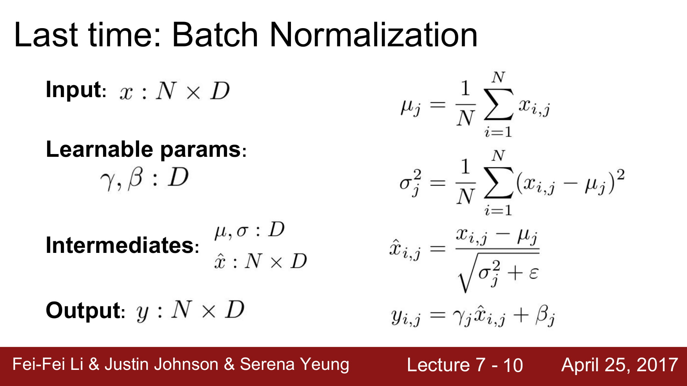
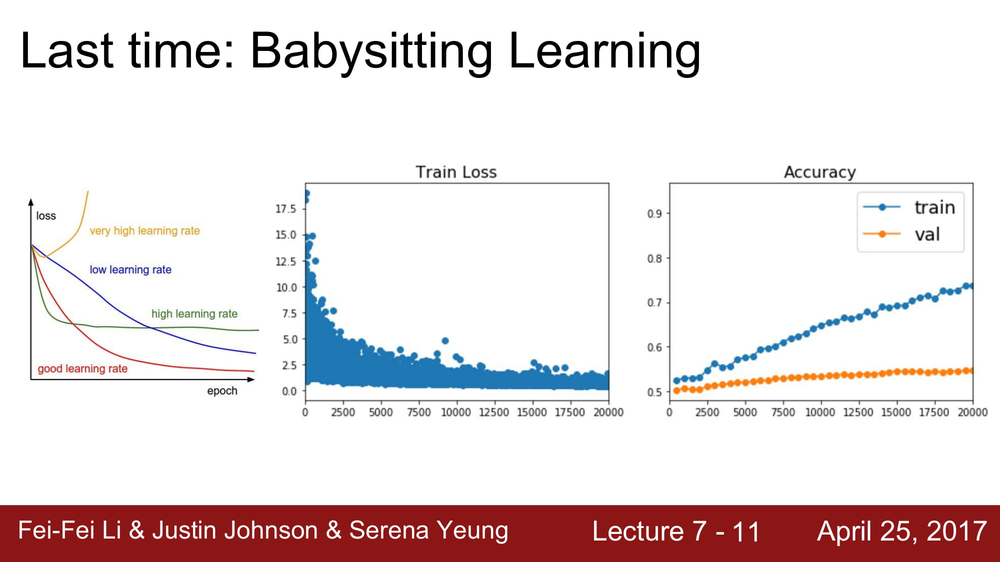
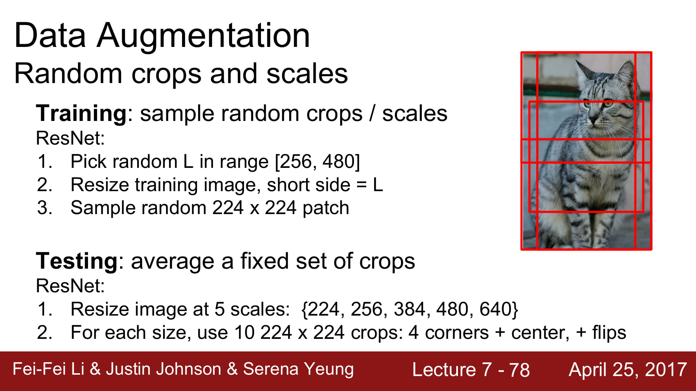

Okay, it's after 12, so I think
we should get started.
Today we're going to kind of pick up
where we left off last time.
Last time we talked about a lot of
sort of tips and tricks involved
in the nitty gritty details of training
neural networks.
Today we'll pick up where we left off,
and talk about a lot more of these
sort of nitty gritty details about
training these things.

As usual, a couple administrative notes
before we get into the material.
As you all know, assignment
one is already due.
Hopefully you all turned it in.
Did it go okay? Was it not okay?
Rough sentiment?
Mostly okay.
Okay, that's good.
Awesome. [laughs]
We're in the process of grading those,
so stay turned.
We're hoping to get grades back for those
before A two is due.
Another reminder, that
your project proposals
are due tomorrow.
Actually, no, today at 11:59.
Make sure you send those in.
Details are on the website and on Piazza.
Also a reminder, assignment
two is already out.
That'll be due a week from Thursday.
Historically, assignment two has been the
longest one in the class, so if you
haven't started already on assignment two,
I'd recommend you take a look at that
pretty soon.

Another reminder is
that for assignment two,
I think of a lot of you will be using
Google Cloud.
Big reminder, make sure
to stop your instances
when you're not using them because
whenever your instance
is on, you get charged,
and we only have so many coupons
to distribute to you guys.
Anytime your instance is on, even if
you're not SSH to it, even if you're not
running things immediately
in your Jupyter Notebook,
any time that instance is on,
you're going to be charged.
Just make sure that you explicitly stop
your instances when you're not using them.
In this example, I've
got a little screenshot
of my dashboard on Google Cloud.
I need to go in there and explicitly
go to the dropdown and click stop.
Just make sure that you do this when
you're done working each day.

Another thing to remember is it's kind of
up to you guys to keep
track of your spending
on Google Cloud.
In particular, instances that use GPUs
are a lot more expensive
than those with CPUs.
Rough order of magnitude,
those GPU instances
are around 90 cents to a dollar an hour.
Those are actually quite pricey.
The CPU instances are much cheaper.
The general strategy is that you probably
want to make two instances, one with a GPU
and one without, and then only use that
GPU instance when you really need the GPU.
For example, on assignment two,
most of the assignment,
you should only need
the CPU, so you should only use your
CPU instance for that.
But then the final
question, about TensorFlow
or PyTorch, that will need a GPU.
This'll give you a little bit of practice
with switching between multiple instances
and only using that GPU
when it's really necessary.
Again, just kind of watch your spending.
Try not to go too crazy on these things.

Any questions on the administrative stuff
before we move on?
Question.
[Student] How much RAM should we use?
Question is how much RAM should we use?
I think eight or 16 gigs is probably good
for everything that
you need in this class.
As you scale up the number of CPUs
and the number of RAM, you also end up
spending more money.
If you stick with two or four CPUs
and eight or 16 gigs of RAM, that should
be plenty for all the
homework-related stuff
that you need to do.

As a quick recap, last
time we talked about
activation functions.
We talked about this whole zoo
of different activation functions and some
of their different properties.
We saw that the sigmoid, which used
to be quite popular when
training neural networks
maybe 10 years ago or so, has this problem
with vanishing gradients near the two ends
of the activation function.
tanh has this similar sort of problem.

Kind of the general recommendation is that
you probably want to stick with ReLU
for most cases as sort of a default choice
'cause it tends to work well for a lot
of different architectures.

We also talked about
weight initialization.
Remember that up on the
top, we have this idea
that when you initialize your weights
at the start of training, if those weights
are initialized to be
too small, then if you
look at, then the activations will vanish
as you go through the network because
as you multiply by these small numbers
over and over again, they'll all
sort of decay to zero.
Then everything will be
zero, learning won't happen,
you'll be sad.
On the other hand, if you initialize
your weights too big,
then as you go through
the network and multiply
by your weight matrix
over and over again,
eventually they'll explode.
You'll be unhappy,
there'll be no learning,
it will be very bad.
But if you get that
initialization just right,
for example, using the
Xavier initialization
or the MSRA initialization,
then you kind of keep
a nice distribution of activations
as you go through the network.
Remember that this kind of gets more
and more important and
more and more critical
as your networks get deeper and deeper
because as your network gets deeper,
you're multiplying by
those weight matrices
over and over again with these
more multiplicative terms.

We also talked about
weight initialization.
Remember that up on the
top, we have this idea
that when you initialize your weights
at the start of training, if those weights
are initialized to be
too small, then if you
look at, then the activations will vanish
as you go through the network because
as you multiply by these small numbers
over and over again, they'll all
sort of decay to zero.
Then everything will be
zero, learning won't happen,
you'll be sad.
On the other hand, if you initialize
your weights too big,
then as you go through
the network and multiply
We also talked last time
about data preprocessing.
We talked about how it's pretty typical
in conv nets to zero center and normalize
your data so it has zero
mean and unit variance.
I wanted to provide a little
bit of extra intuition
about why you might
actually want to do this.

Imagine a simple setup where we have
a binary classification problem where we
want to draw a line to
separate these red points
from these blue points.
On the left, you have this idea where
if those data points are
kind of not normalized
and not centered and far
away from the origin,
then we can still use a
line to separate them,
but now if that line
wiggles just a little bit,
then our classification is going to get
totally destroyed.
That kind of means that in the example
on the left, the loss function is now
extremely sensitive to small perturbations
in that linear classifier
in our weight matrix.
We can still represent the same functions,
but that might make
learning quite difficult
because, again, their
loss is very sensitive
to our parameter vector,
whereas in the situation
on the right, if you take that data cloud
and you move it into the
origin and you make it
unit variance, then
now, again, we can still
classify that data quite well, but now
as we wiggle that line a little bit,
then our loss function is less sensitive
to small perturbations
in the parameter values.
That maybe makes optimization
a little bit easier,
as we'll see a little bit going forward.
By the way, this situation is not only
in the linear classification case.
Inside a neural network,
remember we kind of have
these interleavings of these linear
matrix multiplies, or
convolutions, followed by
non-linear activation functions.
If the input to some layer in your
neural network is not centered or not
zero mean, not unit variance, then again,
small perturbations in the weight matrix
of that layer of the network could cause
large perturbations in
the output of that layer,
which, again, might
make learning difficult.
This is kind of a little bit of extra
intuition about why normalization
might be important.

Because we have this
intuition that normalization
is so important, we talked
about batch normalization,
which is where we just
add this additional layer
inside our networks to just force all
of the intermediate
activations to be zero mean
and unit variance.
I've sort of resummarized the
batch normalization equations here
with the shapes a little
bit more explicitly.
Hopefully this can help you out
when you're implementing this thing
on assignment two.
But again, in batch normalization, we have
this idea that in the forward pass,
we use the statistics of the mini batch
to compute a mean and
a standard deviation,
and then use those estimates to normalize
our data on the forward pass.
Then we also reintroduce the scale
and shift parameters to increase
the expressivity of the layer.
You might want to refer back to this
when working on assignment two.

We also talked last
time a little bit about
babysitting the learning process, how you
should probably be looking
at your loss curves
during training.
Here's an example of some networks
I was actually training over the weekend.
This is usually my setup when I'm working
on these things.
On the left, I have some plot showing
the training loss over time.
You can see it's kind of going down,
which means my network
is reducing the loss.
It's doing well.
On the right, there's this plot where
the X axis is, again, time,
or the iteration number,
and the Y axis is my performance measure
both on my training set
and on my validation set.
You can see that as we go over time,
then my training set performance goes up
and up and up and up and
up as my loss function
goes down, but at some
point, my validation set
performance kind of plateaus.
This kind of suggests that maybe
I'm overfitting in this situation.
Maybe I should have been trying to add
additional regularization.

We also talked a bit last time about
hyperparameter search.
All these networks have
sort of a large zoo
of hyperparameters.
It's pretty important
to set them correctly.
We talked a little bit about grid search
versus random search,
and how random search
is maybe a little bit nicer in theory
because in the situation
where your performance
might be more sensitive, with respect
to one hyperparameter than
other, and random search
lets you cover that space
a little bit better.
We also talked about the idea of coarse
to fine search, where when you're doing
this hyperparameter
optimization, probably you
want to start with very wide ranges
for your hyperparameters, only train
for a couple iterations, and then based on
those results, you kind of narrow in
on the range of
hyperparameters that are good.
Now, again, redo your
search in a smaller range
for more iterations.
You can kind of iterate this process
to kind of hone in on the right region
for hyperparameters.
But again, it's really important to,
at the start, have a very coarse range
to start with, where
you want very, very wide
ranges for all your hyperparameters.
Ideally, those ranges should be so wide
that your network is kind of blowing up
at either end of the
range so that you know
that you've searched a wide enough range
for those things.

Question?
- [Student] How many
[speaks too low to hear]
optimize at once?
[speaks too low to hear]
- The question is how many hyperparameters
do we typically search at a time?
Here is two, but there's
a lot more than two
in these typical things.
It kind of depends on the exact model
and the exact architecture, but because
the number of possibilities is exponential
in the number of hyperparameters,
you can't really test too many at a time.
It also kind of depends
on how many machines
you have available.
It kind of varies from person to person
and from experiment to experiment.
But generally, I try
not to do this over more
than maybe two or three or four at a time
at most because, again,
this exponential search
just gets out of control.
Typically, learning rate
is the really important one
that you need to nail first.
Then other things, like regularization,
like learning rate decay, model size,
these other types of things tend to be a
little bit less sensitive
than learning rate.
Sometimes you might do kind of a block
coordinate descent, where you go and find
the good learning rate,
then you go back and try
to look at different model sizes.
This can help you cut down on the
exponential search a little bit,
but it's a little bit problem dependent
on exactly which ones you
should be searching over
in which order.

More questions?
- [Student] [speaks too low to hear]
Another parameter, but then changing that
other parameter, two or
three other parameters,
makes it so that your
learning rate or the ideal
learning rate is still
[speaks too low to hear].
- Question is how often
does it happen where
when you change one hyperparameter,
then the other, the
optimal values of the other
hyperparameters change?
That does happen sometimes,
although for learning rates,
that's typically less of a problem.
For learning rates,
typically you want to get
in a good range, and
then set it maybe even
a little bit lower than
optimal, and let it go
for a long time.
Then if you do that, combined with some
of the fancier optimization
strategies that
we'll talk about today,
then a lot of models
tend to be a little bit less sensitive
to learning rate once you
get them in a good range.

Sorry, did you have a
question in front, as well?
- [Student] [speaks too low to hear]
- The question is what's wrong with having
a small learning rate and increasing
the number of epochs?
The answer is that it might take
a very long time. [laughs]
- [Student] [speaks too low to hear]
- Intuitively, if you
set the learning rate
very low and let it go
for a very long time,
then this should, in theory, always work.
But in practice, those
factors of 10 or 100
actually matter a lot when you're training
these things.
Maybe if you got the right learning rate,
you could train it in six hours, 12 hours
or a day, but then if
you just were super safe
and dropped it by a factor of 10
or by a factor of 100,
now that one-day training
becomes 100 days of training.
That's three months.
That's not going to be good.
When you're taking these intro
computer science classes,
they always kind of sweep
the constants under the rug, but when
you're actually thinking
about training things,
those constants end up mattering a lot.

Another question?
- [Student] If you have
a low learning rate,
[speaks too low to hear].
- Question is for a low learning rate,
are you more likely to
be stuck in local optima?
I think that makes some intuitive sense,
but in practice, that seems not to be much
of a problem.
I think we'll talk a bit
more about that later today.

Today I wanted to talk about a couple
other really interesting
and important topics
when we're training neural networks.
In particular, I wanted to talk,
we've kind of alluded to this fact
of fancier, more powerful
optimization algorithms
a couple times.
I wanted to spend some
time today and really
dig into those and talk about what are the
actual optimization
algorithms that most people
are using these days.
We also touched on regularization
in earlier lectures.
This concept of making your network
do additional things to reduce the gap
between train and test error.
I wanted to talk about
some more strategies
that people are using in practice
of regularization, with
respect to neural networks.
Finally, I also wanted to talk a bit
about transfer learning, where you can
sometimes get away with using less data
than you think by transferring from
one problem to another.

If you recall from a few lectures ago,
the kind of core strategy in training
neural networks is an optimization problem
where we write down some loss function,
which defines, for each
value of the network weights,
the loss function tells us how good or bad
is that value of the weights
doing on our problem.
Then we imagine that this loss function
gives us some nice
landscape over the weights,
where on the right, I've shown this maybe
small, two-dimensional
problem, where the X
and Y axes are two values of the weights.
Then the color of the
plot kind of represents
the value of the loss.
In this kind of cartoon picture
of a two-dimensional problem, we're only
optimizing over these
two values, W one, W two.
The goal is to find the most red region
in this case, which
corresponds to the setting
of the weights with the lowest loss.
Remember, we've been working so far
with this extremely simple
optimization algorithm,
stochastic gradient descent,
where it's super simple, it's three lines.
While true, we first evaluate the loss
in the gradient on some
mini batch of data.
Then we step, updating
our parameter vector
in the negative direction of the gradient
because this gives, again, the direction
of greatest decrease of the loss function.
Then we repeat this over and over again,
and hopefully we converge
to the red region
and we get great errors
and we're very happy.
But unfortunately, this relatively simple
optimization algorithm has
quite a lot of problems
that actually could come up in practice.

One problem with stochastic
gradient descent,
imagine what happens if
our objective function
looks something like this, where, again,
we're plotting two
values, W one and W two.
As we change one of those values,
the loss function changes very slowly.
As we change the horizontal
value, then our loss
changes slowly.
As we go up and down in this landscape,
now our loss is very sensitive to changes
in the vertical direction.
By the way, this is
referred to as the loss
having a bad condition
number at this point,
which is the ratio between
the largest and smallest
singular values of the Hessian matrix
at that point.
But the intuitive idea is
that the loss landscape
kind of looks like a taco shell.
It's sort of very
sensitive in one direction,
not sensitive in the other direction.
The question is what might SGD,
stochastic gradient
descent, do on a function
that looks like this?

If you run stochastic gradient descent
on this type of function, you might get
this characteristic zigzagging behavior,
where because for this
type of objective function,
the direction of the
gradient does not align
with the direction towards the minima.
When you compute the
gradient and take a step,
you might step sort of over this line
and sort of zigzag back and forth.
In effect, you get very
slow progress along
the horizontal dimension, which is the
less sensitive dimension, and you get this
zigzagging, nasty, nasty
zigzagging behavior
across the fast-changing dimension.
This is undesirable behavior.
By the way, this problem actually becomes
much more common in high dimensions.
In this kind of cartoon
picture, we're only
showing a two-dimensional
optimization landscape,
but in practice, our
neural networks might have
millions, tens of millions,
hundreds of millions
of parameters.
That's hundreds of millions of directions
along which this thing can move.
Now among those hundreds of millions
of different directions to move,
if the ratio between the largest one
and the smallest one is bad, then SGD
will not perform so nicely.
You can imagine that if we
have 100 million parameters,
probably the maximum
ratio between those two
will be quite large.
I think this is actually
quite a big problem
in practice for many
high-dimensional problems.

Another problem with SGD
has to do with this idea
of local minima or saddle points.
Here I've sort of swapped
the graph a little bit.
Now the X axis is showing the value
of one parameter, and then the Y axis
is showing the value of the loss.
In this top example, we have kind of this
curvy objective function, where there's a
valley in the middle.
What happens to SGD in this situation?
- [Student] [speaks too low to hear]

- In this situation, SGD will get stuck
because at this local minima, the gradient
is zero because it's locally flat.
Now remember with SGD,
we compute the gradient
and step in the direction
of opposite gradient,
so if at our current point,
the opposite gradient
is zero, then we're not
going to make any progress,
and we'll get stuck at this point.
There's another problem with this idea
of saddle points.
Rather than being a local minima,
you can imagine a point
where in one direction
we go up, and in the other
direction we go down.
Then at our current point,
the gradient is zero.
Again, in this situation, the function
will get stuck at the saddle point because
the gradient is zero.

Although one thing I'd like to point out
is that in one dimension,
in a one-dimensional problem
like this, local minima
seem like a big problem
and saddle points seem like kind of not
something to worry about, but in fact,
it's the opposite once you move to very
high-dimensional problems because, again,
if you think about you're in this
100 million dimensional space,
what does a saddle point mean?
That means that at my current point,
some directions the loss goes up,
and some directions the loss goes down.
If you have 100 million dimensions,
that's probably going to
happen more frequently than,
that's probably going to happen
almost everywhere, basically.
Whereas a local minima
says that of all those
every one of them causes
the loss to go up.
In fact, that seems pretty rare when
you're thinking about, again, these very
high-dimensional problems.
Really, the idea that has come to light
in the last few years is that when
you're training these very
large neural networks,
the problem is more about saddle points
and less about local minima.
By the way, this also is a problem
not just exactly at the saddle point,
but also near the saddle point.
If you look at the example on the bottom,
you see that in the regions around
the saddle point, the gradient isn't zero,
but the slope is very small.
That means that if we're,
again, just stepping
in the direction of the gradient,
and that gradient is very
small, we're going to make
very, very slow progress whenever our
current parameter value
is near a saddle point
in the objective landscape.
This is actually a big problem.

Another problem with SGD comes from the S.
Remember that SGD is
stochastic gradient descent.
Recall that our loss function is typically
defined by computing the loss over many,
many different examples.
In this case, if N is
your whole training set,
then that could be
something like a million.
Each time computing
the loss would be very,
very expensive.
In practice, remember
that we often estimate
the loss and estimate the gradient
using a small mini batch of examples.
What this means is that we're not actually
getting the true information
about the gradient
at every time step.
Instead, we're just
getting some noisy estimate
of the gradient at our current point.
Here on the right, I've kind of faked
this plot a little bit.
I've just added random uniform noise
to the gradient at every point, and then
run SGD with these noisy,
messed up gradients.
This is maybe not exactly what happens
with the SGD process,
but it still give you
the sense that if there's noise in your
gradient estimates, then vanilla SGD
kind of meanders around the space
and might actually take a long time
to get towards the minima.
Now that we've talked about a lot
of these problems.

Sorry, was there a question?
- [Student] [speaks too low to hear]
- The question is do all of these
just go away if we use
normal gradient descent?
Let's see.
I think that the taco shell problem
of high condition numbers
is still a problem
with full batch gradient descent.
The noise.
As we'll see, we might sometimes introduce
additional noise into the network,
not only due to sampling mini batches,
but also due to explicit
stochasticity in the network,
so we'll see that later.
That can still be a problem.
Saddle points, that's still a problem
for full batch gradient descent because
there can still be saddle points
in the full objective landscape.
Basically, even if we go to full batch
gradient descent, it doesn't really solve
these problems.
We kind of need to think
about a slightly fancier
optimization algorithm that can try
to address these concerns.
Thankfully, there's a really,
really simple strategy
that works pretty well at addressing
many of these problems.

That's this idea of adding a momentum term
to our stochastic gradient descent.
Here on the left, we have our classic
old friend, SGD, where we just always step
in the direction of the gradient.
But now on the right, we have this minor,
minor variance called SGD plus momentum,
which is now two equations
and five lines of code,
so it's twice as complicated.
But it's very simple.
The idea is that we maintain a velocity
over time, and we add
our gradient estimates
to the velocity.
Then we step in the
direction of the velocity,
rather than stepping in the
direction of the gradient.
This is very, very simple.
We also have this hyperparameter rho now
which corresponds to friction.
Now at every time step, we take our
current velocity, we
decay the current velocity
by the friction constant,
rho, which is often
something high, like .9
We take our current velocity, we decay it
by friction and we add in our gradient.
Now we step in the direction
of our velocity vector,
rather than the direction of our
raw gradient vector.

This super, super simple strategy
actually helps for all of these problems
that we just talked about.
If you think about what
happens at local minima
or saddle points, then if we're imagining
velocity in this system,
then you kind of have
this physical interpretation of this ball
kind of rolling down the
hill, picking up speed
as it comes down.
Now once we have velocity,
then even when we
pass that point of local minima,
the point will still have velocity,
even if it doesn't have gradient.
Then we can hopefully get
over this local minima
and continue downward.
There's this similar
intuition near saddle points,
where even though the gradient around
the saddle point is very small, we have
this velocity vector that we've built up
as we roll downhill.
That can hopefully carry us through
the saddle point and
let us continue rolling
all the way down.
If you think about what happens in
poor conditioning, now if we were to have
these kind of zigzagging approximations
to the gradient, then those zigzags
will hopefully cancel
each other out pretty fast
once we're using momentum.
This will effectively reduce the amount
by which we step in the
sensitive direction,
whereas in the horizontal direction,
our velocity will just keep building up,
and will actually accelerate our descent
across that less sensitive dimension.
Adding momentum here can actually help us
with this high condition
number problem, as well.
Finally, on the right, we've repeated
the same visualization of
gradient descent with noise.
Here, the black is this vanilla SGD,
which is sort of zigzagging
all over the place,
where the blue line is showing now SGD
with momentum.
You can see that because we're adding it,
we're building up this velocity over time,
the noise kind of gets averaged out
in our gradient estimates.
Now SGD ends up taking
a much smoother path
towards the minima, compared with the SGD,
which is kind of meandering due to noise.

Question?
- [Student] [speaks too low to hear]
- The question is how does SGD momentum
help with the poorly
conditioned coordinate?
The idea is that if you go back and look
at this velocity estimate and look
at the velocity
computation, we're adding in
the gradient at every time step.
It kind of depends on your setting of rho,
that hyperparameter, but you can imagine
that if the gradient is relatively small,
and if rho is well
behaved in this situation,
then our velocity could
actually monotonically increase
up to a point where the velocity could now
be larger than the actual gradient.
Then we might actually
make faster progress
along the poorly conditioned dimension.

Kind of one picture that
you can have in mind
when we're doing SGD plus momentum is that
the red here is our current point.
At our current point,
we have some red vector,
which is the direction of the gradient,
or rather our estimate of the gradient
at the current point.
Green is now the direction
of our velocity vector.
Now when we do the momentum update,
we're actually stepping according to a
weighted average of these two.
This helps overcome some noise in our
gradient estimate.

There's a slight variation of momentum
that you sometimes see, called
Nesterov accelerated gradient,
also sometimes called Nesterov momentum.
That switches up this order of things
a little bit.
In sort of normal SGD momentum, we imagine
that we estimate the gradient
at our current point,
and then take a mix of our velocity
and our gradient.
With Nesterov accelerated gradient, you do
something a little bit different.
Here, you start at the red point.
You step in the direction
of where the velocity
would take you.
You evaluate the gradient at that point.
Then you go back to your original point
and kind of mix together those two.
This is kind of a funny interpretation,
but you can imagine that you're kind of
mixing together information
a little bit more.
If your velocity direction was actually
a little bit wrong, it
lets you incorporate
gradient information
from a little bit larger
parts of the objective landscape.
This also has some really
nice theoretical properties
when it comes to convex optimization,
but those guarantees go a little bit
out the window once it
comes to non-convex problems
like neural networks.

Writing it down in
equations, Nesterov momentum
looks something like this, where now
to update our velocity, we take a step,
according to our previous
velocity, and evaluate
that gradient there.
Now when we take our next step,
we actually step in the
direction of our velocity
that's incorporating information from
these multiple points.
Question?

- [Student] [speaks too low to hear]
- Oh, sorry.
The question is what's
a good initialization
for the velocity?
This is almost always zero.
It's not even a hyperparameter.
Just set it to zero and don't worry.
Another question?

- [Student] [speaks too low to hear]
- Intuitively, the velocity
is kind of a weighted sum
of your gradients that
you've seen over time.

- [Student] [speaks too low to hear]
- With more recent gradients
being weighted heavier.
At every time step, we
take our old velocity,
we decay by friction and we add in
our current gradient.
You can kind of think of this as a
smooth moving average
of your recent gradients
with kind of a exponentially
decaying weight
on your gradients going back in time.

This Nesterov formulation
is a little bit annoying
'cause if you look at
this, normally when you
have your loss function,
you want to evaluate
your loss and your
gradient at the same point.
Nesterov breaks this a little bit.
It's a little bit annoying to work with.

Thankfully, there's a
cute change of variables
you can do.
If you do the change of variables
and reshuffle a little bit, then you can
write Nesterov momentum in
a slightly different way
that now, again, lets
you evaluate the loss
and the gradient at the same point always.
Once you make this change of variables,
you get kind of a nice
interpretation of Nesterov,
which is that here in the first step,
this looks exactly like
updating the velocity
in the vanilla SGD momentum case, where we
have our current velocity,
we evaluate gradient
at the current point and
mix these two together
in a decaying way.
Now in the second update,
now when we're actually
updating our parameter vector, if you look
at the second equation,
we have our current point
plus our current velocity plus
a weighted difference
between our current velocity
and our previous velocity.
Here, Nesterov momentum
is kind of incorporating
some kind of error-correcting term between
your current velocity and
your previous velocity.

If we look at SGD, SGD momentum
and Nesterov momentum
on this kind of simple
problem, compared with SGD, we notice that
SGD kind of takes this,
SGD is in the black,
kind of taking this slow
progress toward the minima.
The blue and the green show momentum
and Nesterov.
These have this behavior
of kind of overshooting
the minimum 'cause they're
building up velocity
going past the minimum, and then kind of
correcting themselves and coming back
towards the minima.

Question?
- [Student] [speaks too low to hear]
- The question is this picture looks good,
but what happens if your minima call
lies in this very narrow basin?
Will the velocity just cause you
to skip right over that minima?
That's actually a really
interesting point,
and the subject of some
recent theoretical work,
but the idea is that maybe those really
sharp minima are actually bad minima.
We don't want to even land in those
'cause the idea is that maybe if you have
a very sharp minima, that actually could
be a minima that overfits more.
If you imagine that we
doubled our training set,
the whole optimization
landscape would change,
and maybe that very sensitive minima
would actually disappear
if we were to collect
more training data.
We kind of have this intuition that we
maybe want to land in very flat minima
because those very flat
minima are probably
more robust as we change
the training data.
Those flat minima might
actually generalize
better to testing data.
This is again, sort of very recent
theoretical work, but that's actually
a really good point that you bring it up.
In some sense, it's actually a feature
and not a bug that SGD momentum actually
skips over those very sharp minima.
That's actually a good
thing, believe it or not.
Another thing you can see is if you look
at the difference between
momentum and Nesterov here,
you can see that because of the
correction factor in
Nesterov, maybe it's not
overshooting quite as drastically,
compared to vanilla momentum.

There's another kind
of common optimization
strategy is this algorithm called AdaGrad,
which John Duchi, who's
now a professor here,
worked on during his Ph.D.
The idea with AdaGrad is that as you,
during the course of the optimization,
you're going to keep a running estimate
or a running sum of all
the squared gradients
that you see during training.
Now rather than having a velocity term,
instead we have this grad squared term.
During training, we're
going to just keep adding
the squared gradients to
this grad squared term.
Now when we update our parameter vector,
we'll divide by this grad squared term
when we're making our update step.

The question is what
does this kind of scaling
do in this situation where we have
a very high condition number?

- [Student] [speaks too low to hear]
- The idea is that if
we have two coordinates,
one that always has a very high gradient
and one that always has
a very small gradient,
then as we add the sum of the squares
of the small gradient,
we're going to be dividing
by a small number, so
we'll accelerate movement
along the slow dimension,
along the one dimension.
Then along the other
dimension, where the gradients
tend to be very large,
then we'll be dividing
by a large number, so
we'll kind of slow down
our progress along the wiggling dimension.
But there's kind of a problem here.
That's the question of
what happens with AdaGrad
over the course of training, as t
gets larger and larger and larger?

- [Student] [speaks too low to hear]
- With AdaGrad, the steps
actually get smaller
and smaller and smaller because we just
continue updating this estimate of the
squared gradients over
time, so this estimate
just grows and grows
and grows monotonically
over the course of training.
Now this causes our
step size to get smaller
and smaller and smaller over time.
Again, in the convex case, there's some
really nice theory showing
that this is actually
really good 'cause in the convex case,
as you approach a
minimum, you kind of want
to slow down so you actually converge.
That's actually kind of a feature
in the convex case.
But in the non-convex
case, that's a little bit
problematic because as you come towards
a saddle point, you might
get stuck with AdaGrad,
and then you kind of no
longer make any progress.
There's a slight variation of AdaGrad,

called RMSProp, that actually addresses
this concern a little bit.
Now with RMSProp, we
still keep this estimate
of the squared gradients, but instead
of just letting that squared estimate
continually accumulate over training,
instead, we let that squared
estimate actually decay.
This ends up looking kind
of like a momentum update,
except we're having kind of momentum over
the squared gradients,
rather than momentum
over the actual gradients.
Now with RMSProp, after
we compute our gradient,
we take our current estimate
of the grad squared,
we multiply it by this decay rate,
which is commonly
something like .9 or .99.
Then we add in this one
minus the decay rate
of our current squared gradient.
Now over time, you can imagine that.
Then again, when we
make our step, the step
looks exactly the same as AdaGrad,
where we divide by the squared gradient
in the step to again
have this nice property
of accelerating movement
along the one dimension,
and slowing down movement
along the other dimension.
But now with RMSProp,
because these estimates
are leaky, then it kind
of addresses the problem
of maybe always slowing down where you
might not want to.

Here again, we're kind
of showing our favorite
toy problem with SGD
in black, SGD momentum
in blue and RMSProp in red.
You can see that RMSProp and SGD momentum
are both doing much better than SGD,
but their qualitative behavior
is a little bit different.
With SGD momentum, it kind of overshoots
the minimum and comes back, whereas with
RMSProp, it's kind of adjusting
its trajectory such that we're making
approximately equal progress among
all the dimensions.
By the way, you can't actually tell,
but this plot is also
showing AdaGrad in green
with the same learning rate, but it just
gets stuck due to this
problem of continually
decaying learning rates.
In practice, AdaGrad
is maybe not so common
for many of these things.
That's a little bit of
an unfair comparison
of AdaGrad.
Probably you need to
increase the learning rate
with AdaGrad, and then
it would end up looking
kind of like RMSProp in this case.
But in general, we tend not to use AdaGrad
so much when training neural networks.

Question?
[Student] [speaks too low to hear]
The answer is yes,
this problem is convex,
but in this case,
it's a little bit of an unfair comparison
because the learning rates
are not so comparable
among the methods.
I've been a little bit unfair to AdaGrad
in this visualization by showing the same
learning rate between
the different algorithms,
when probably you should have separately
turned the learning rates per algorithm.

We saw in momentum, we had this idea
of velocity, where we're
building up velocity
by adding in the gradients,
and then stepping
in the direction of the velocity.
We saw with AdaGrad and RMSProp that we
had this other idea, of
building up an estimate
of the squared gradients,
and then dividing
by the squared gradients.
Then these both seem like good ideas
on their own.
Why don't we just stick 'em together
and use them both?
Maybe that would be even better.

That brings us to this
algorithm called Adam,
or rather brings us very close to Adam.
We'll see in a couple
slides that there's a slight
correction we need to make here.
Here with Adam, we maintain an estimate
of the first moment and the second moment.
Now in the red, we make this estimate
of the first moment as a weighed sum
of our gradients.
We have this moving estimate
of the second moment,
like AdaGrad and like RMSProp, which is a
moving estimate of our squared gradients.
Now when we make our update step, we step
using both the first
moment, which is kind of our
velocity, and also divide
by the second moment,
or rather the square root
of the second moment,
which is this squared gradient term.
This idea of Adam ends
up looking a little bit
like RMSProp plus momentum, or ends up
looking like momentum plus
second squared gradients.
It kind of incorporates the
nice properties of both.
But there's a little
bit of a problem here.
That's the question of what happens
at the very first time step?
At the very first time step, you can see
that at the beginning, we've initialized
our second moment with zero.
Now after one update of the second moment,
typically this beta two, second moment
decay rate, is something like .9 or .99,
something very close to one.
After one update, our
second moment is still
very, very close to zero.
Now when we're making our update step here
and we divide by our second moment,
now we're dividing by a very small number.
We're making a very, very large step
at the beginning.
This very, very large
step at the beginning
is not really due to the
geometry of the problem.
It's kind of an artifact
of the fact that we
initialized our second
moment estimate was zero.

Question?
[Student] [speaks too low to hear]
That's true.
The comment is that if your first moment
is also very small,
then you're multiplying
by small and you're
dividing by square root
of small squared, so
what's going to happen?
They might cancel each other
out, you might be okay.
That's true.
Sometimes these cancel each other out
and you're okay, but
sometimes this ends up
in taking very large steps
right at the beginning.
That can be quite bad.
Maybe you initialize a little bit poorly.
You take a very large step.
Now your initialization
is completely messed up,
and then you're in a very bad part
of the objective landscape
and you just can't
converge from there.
Question?

[Student] [speaks too low to hear]
The idea is what is this 10
to the minus seven term
in the last equation?
That's actually appeared in AdaGrad,
RMSProp and Adam.
The idea is that we're
dividing by something.
We want to make sure we're
not dividing by zero,
so we always add a small positive constant
to the denominator, just to make sure
we're not dividing by zero.
That's technically a hyperparameter,
but it tends not to matter too much,
so just setting 10 to minus seven,
tends to work well.

With Adam, remember we just talked about
this idea of at the first couple steps,
it gets very large, and we might take
very large steps and mess ourselves up.
Adam also adds this bias correction term
to avoid this problem of
taking very large steps
at the beginning.
You can see that after we update our first
and second moments, we
create an unbiased estimate
of those first and second
moments by incorporating
the current time step, t.
Now we actually make our step using these
unbiased estimates,
rather than the original
first and second moment estimates.
This gives us our full form of Adam.

By the way, Adam is a
really, [laughs] really good
optimization algorithm,
and it works really well
for a lot of different
problems, so that's kind of
my default optimization
algorithm for just about
any new problem that I'm tackling.
In particular, if you
set beta one equals .9,
beta two equals .999, learning rate one e
minus three or five e minus four,
that's a great staring
point for just about
all the architectures
I've ever worked with.
Try that.
That's a really good place
to start, in general.
[laughs]

If we actually plot these things out
and look at SGD, SGD momentum,
RMSProp and Adam on the same problem,
you can see that Adam, in the purple here,
kind of combines elements
of both SGD momentum
and RMSProp.
Adam kind of overshoots the minimum
a little bit like SGD
momentum, but it doesn't
overshoot quite as much as momentum.
Adam also has this similar behavior
of RMSProp of kind of trying to curve
to make equal progress
along all dimensions.
Maybe in this small
two-dimensional example,
Adam converged about
similarly to other ones,
but you can see qualitatively that
it's kind of combining
the behaviors of both
momentum and RMSProp.
Any questions about
optimization algorithms?
[Student] [speaks too low to hear]
They still take a very long time to train.
[speaks too low to hear]
The question is what does Adam not fix?
Would these neural
networks are still large,
they still take a long time to train.
There can still be a problem.
In this picture where
we have this landscape
of things looking like
ovals, if you imagine
that we're kind of making estimates along
each dimension independently to allow us
to speed up or slow down along different
coordinate axes, but one problem is that
if that taco shell is kind of tilted
and is not axis aligned, then we're still
only making estimates
along the individual axes
independently.
That corresponds to taking your rotated
taco shell and squishing it horizontally
and vertically, but you
can't actually unrotate it.
In cases where you have this kind
of rotated picture of poor conditioning,
then Adam or any of these other algorithms
really can't address that, that concern.

Another thing that we've seen in all
these optimization
algorithms is learning rate
as a hyperparameter.
We've seen this picture
before a couple times,
that as you use different learning rates,
sometimes if it's too
high, it might explode
in the yellow.
If it's a very low
learning rate, in the blue,
it might take a very
long time to converge.
It's kind of tricky to pick the right
learning rate.
This is a little bit of a trick question
because we don't actually have to stick
with one learning rate
throughout the course
of training.

Sometimes you'll see people
decay the learning rates
over time, where we can kind of combine
the effects of these different curves
on the left, and get the
nice properties of each.
Sometimes you'll start
with a higher learning rate
near the start of training, and then decay
the learning rate and make it smaller
and smaller throughout
the course of training.
A couple strategies for
these would be a step decay,
where at 100,000th
iteration, you just decay
by some factor and you keep going.
You might see an exponential decay,
where you continually
decay during training.
You might see different variations
of continually decaying the learning rate
during training.

If you look at papers,
especially the resonate paper,
you often see plots that
look kind of like this,
where the loss is kind of going down,
then dropping, then flattening again,
then dropping again.
What's going on in these plots is that
they're using a step decay learning rate,
where at these parts where it plateaus
and then suddenly drops
again, those are the
iterations where they
dropped the learning rate
by some factor.
This idea of dropping the learning rate,
you might imagine that it got near
some good region, but now
the gradients got smaller,
it's kind of bouncing around too much.
Then if we drop the learning rate,
it lets it slow down and continue
to make progress down the landscape.
This tends to help in practice sometimes.
Although one thing to point out is that
learning rate decay is
a little bit more common
with SGD momentum, and
a little bit less common
with something like Adam.

Another thing I'd like
to point out is that
learning rate decay is kind of a
second-order hyperparameter.
You typically should not optimize
over this thing from the start.
Usually when you're
kind of getting networks
to work at the beginning, you want to pick
a good learning rate with
no learning rate decay
from the start.
Trying to cross-validate jointly over
learning rate decay and
initial learning rate
and other things, you'll
just get confused.
What you do for setting
learning rate decay
is try with no decay, see what happens.
Then kind of eyeball
the loss curve and see
where you think you might need decay.

Another thing I wanted to mention briefly
is this idea of all these algorithms
that we've talked about
are first-order optimization algorithms.
In this picture, in this
one-dimensional picture,
we have this kind of
curvy objective function
at our current point in red.

What we're basically doing is computing
the gradient at that point.
We're using the gradient
information to compute
some linear approximation to our function,
which is kind of a first-order
Taylor approximation
to our function.
Now we pretend that the
first-order approximation
is our actual function, and we make a step
to try to minimize the approximation.
But this approximation doesn't hold
for very large regions, so we can't step
too far in that direction.
But really, the idea
here is that we're only
incorporating information about the first
derivative of the function.
You can actually go a little bit fancier.
There's this idea of
second-order approximation,

where we take into account
both first derivative
and second derivative information.
Now we make a second-order
Taylor approximation
to our function and kind
of locally approximate
our function with a quadratic.
Now with a quadratic, you can step right
to the minimum, and you're really happy.
That's this idea of
second-order optimization.

When you generalize this
to multiple dimensions,
you get something called the Newton step,
where you compute this Hessian matrix,
which is a matrix of second derivatives,
and you end up inverting
this Hessian matrix
in order to step directly to the minimum
of this quadratic
approximation to your function.
Does anyone spot something
that's quite different
about this update rule,
compared to the other ones
that we've seen?

[Student] [speaks too low to hear]
This doesn't have a learning rate.
That's kind of cool.
We're making this quadratic approximation
and we're stepping right to the minimum
of the quadratic.
At least in this vanilla
version of Newton's method,
you don't actually need a learning rate.
You just always step to the minimum
at every time step.
However, in practice, you might end up,
have a learning rate
anyway because, again,
that quadratic approximation
might not be perfect,
so you might only want
to step in the direction
towards the minimum, rather than actually
stepping to the minimum, but at least
in this vanilla version, it doesn't
have a learning rate.

But unfortunately, this is maybe
a little bit impractical for deep learning
because this Hessian matrix
is N by N, where N is
the number of parameters
in your network.
If N is 100 million,
then 100 million squared
is way too big.
You definitely can't store that in memory,
and you definitely can't invert it.

In practice, people sometimes use these
quasi-Newton methods
that, rather than working
with the full Hessian and inverting
the full Hessian, they
work with approximations.
Low-rank approximations are common.
You'll sometimes see
these for some problems.

L-BFGS is one particular
second-order optimizer
that has this approximate second,
keeps this approximation of the Hessian
that you'll sometimes
see, but in practice,
it doesn't work too well for many
deep learning problems
because these approximations,
these second-order
approximations, don't really
handle the stochastic case very much,
very nicely.
They also tend not to work so well with
non-convex problems.
I don't want to get into
that right now too much.

In practice, what you should really do
is probably Adam is a really good choice
for many different neural network things,
but if you're in a situation where you
can afford to do full batch updates,
and you know that your
problem doesn't have
really any stochasticity, then L-BFGS
is kind of a good choice.
L-BFGS doesn't really
get used for training
neural networks too much, but as we'll see
in a couple of lectures, it does sometimes
get used for things like style transfer,
where you actually have less stochasticity
and fewer parameters, but you still want
to solve an optimization problem.

All of these strategies we've talked about
so far are about reducing training error.
All these optimization
algorithms are really
about driving down your training error
and minimizing your objective function,
but we don't really care about
training error that much.
Instead, we really care
about our performance
on unseen data.
We really care about reducing this gap
between train and test error.
The question is once we're already
good at optimizing our objective function,
what can we do to try to reduce this gap
and make our model perform better
on unseen data?

One really quick and dirty, easy thing
to try is this idea of model ensembles
that sometimes works
across many different areas
in machine learning.
The idea is pretty simple.
Rather than having just one model,
we'll train 10 different
models independently
from different initial random restarts.
Now at test time, we'll run our data
through all of the 10 models and average
the predictions of those 10 models.
Adding these multiple models together
tends to reduce overfitting a little bit
and tend to improve
performance a little bit,
typically by a couple percent.
This is generally not
a drastic improvement,
but it is a consistent improvement.
You'll see that in competitions, like
ImageNet and other things like that,
using model ensembles is very common
to get maximal performance.

You can actually get a little
bit creative with this.
Sometimes rather than
training separate models
independently, you can just keep multiple
snapshots of your model during the course
of training, and then use these
as your ensembles.
Then you still, at test
time, need to average
the predictions of these
multiple snapshots,
but you can collect the snapshots during
the course of training.

There's actually a very
nice paper being presented
at ICLR this week that kind of has
a fancy version of this idea, where we use
a crazy learning rate schedule,
where our learning rate goes very slow,
then very fast, then very
slow, then very fast.
The idea is that with this crazy
learning rate schedule,
then over the course
of training, the model
might be able to converge
to different regions in
the objective landscape
that all are reasonably good.
If you do an ensemble over these
different snapshots, then you can improve
your performance quite nicely,
even though you're only
training the model once.

Questions?
[Student] [speaks too low to hear]
The question is, it's bad when
there's a large gap between error 'cause
that means you're overfitting, but if
there's no gap, then
is that also maybe bad?
Do we actually want
some small, optimal gap
between the two?
We don't really care about the gap.
What we really care about is maximizing
the performance on the validation set.
What tends to happen is that if you
don't see a gap, then
you could have improved
your absolute performance, in many cases,
by overfitting a little bit more.
There's this weird correlation between
the absolute performance
on the validation set
and the size of that gap.
We only care about absolute performance.

Question in the back?
[Student] Are hyperparameters the same
for the ensemble?
- Are the hyperparameters the same
for the ensembles?
That's a good question.
Sometimes they're not.
You might want to try
different sizes of the model,
different learning rates, different
regularization strategies
and ensemble across
these different things.
That actually does happen sometimes.

Another little trick you can do sometimes
is that during training,
you might actually keep
an exponentially decaying average
of your parameter vector
itself to kind of have
a smooth ensemble of your own network
during training.
Then use this smoothly decaying average
of your parameter vector, rather than
the actual checkpoints themselves.
This is called Polyak averaging,
and it sometimes helps a little bit.
It's just another one
of these small tricks
you can sometimes add, but it's not maybe
too common in practice.

Another question you might have is that
how can we actually
improve the performance
of single models?
When we have ensembles,
we still need to run,
like, 10 models at test time.
That's not so great.
We really want some strategies to improve
the performance of our single models.
That's really this idea of regularization,
where we add something to our model
to prevent it from
fitting the training data
too well in the attempts
to make it perform better
on unseen data.

We've seen a couple
ideas, a couple methods
for regularization already, where we add
some explicit extra term to the loss.
Where we have this one
term telling the model
to fit the data, and another term
that's a regularization term.
You saw this in homework
one, where we used
As we talked about in lecture a couple
lectures ago, this L2
regularization doesn't
really make maybe a lot
of sense in the context
of neural networks.
Sometimes we use other
things for neural networks.

One regularization strategy that's super,
super common for neural networks
is this idea of dropout.
Dropout is super simple.
Every time we do a forward pass through
the network, at every
layer, we're going to
randomly set some neurons to zero.
Every time we do a forward pass,
we'll set a different random subset
of the neurons to zero.
This kind of proceeds one layer at a time.
We run through one layer, we compute
the value of the layer, we randomly set
some of them to zero,
and then we continue up
through the network.
Now if you look at this
fully connected network
on the left versus a dropout version
of the same network on
the right, you can see
that after we do dropout, it kind of looks
like a smaller version
of the same network,
where we're only using
some subset of the neurons.
This subset that we use
varies at each iteration,
at each forward pass.

Question?
[Student] [speaks too low to hear]
The question is what
are we setting to zero?
It's the activations.
Each layer is computing
previous activation
times the weight matrix gives you
our next activation.
Then you just take that activation,
set some of them to zero, and then
your next layer will be
partially zeroed activations
times another matrix give
you your next activations.

Question?
[Student] [speaks too low to hear]
Question is which
layers do you do this on?
It's more common in
fully connected layers,
but you sometimes see this in
convolutional layers, as well.
When you're working in
convolutional layers,
sometimes instead of dropping
each activation randomly,
instead you sometimes
might drop entire feature maps randomly.
In convolutions, you have
this channel dimension,
and you might drop out entire channels,
rather than random elements.

Dropout is kind of super
simple in practice.
It only requires adding two lines,
one line per dropout call.
Here we have a three-layer neural network,
and we've added dropout.
You can see that all we needed to do
was add this extra line where we randomly
set some things to zero.
This is super easy to implement.

But the question is why
is this even a good idea?
We're seriously messing with the network
at training time by setting a bunch
of its values to zero.
How can this possibly make sense?
One sort of slightly hand wavy idea
that people have is that
dropout helps prevent
co-adaptation of features.
Maybe if you imagine that we're trying
to classify cats, maybe in some universe,
the network might learn one neuron
for having an ear, one
neuron for having a tail,
one neuron for the input being furry.
Then it kind of combines
these things together
to decide whether or not it's a cat.
But now if we have dropout, then in making
the final decision about
catness, the network
cannot depend too much on any of these
one features.
Instead, it kind of needs to distribute
its idea of catness across
many different features.
This might help prevent
overfitting somehow.

Another interpretation of dropout
that's come out a little bit more recently
is that it's kind of like
doing model ensembling
within a single model.
If you look at the picture on the left,
after you apply dropout to the network,
we're kind of computing this subnetwork
using some subset of the neurons.
Now every different potential dropout mask
leads to a different potential subnetwork.
Now dropout is kind of
learning a whole ensemble
of networks all at the same time that all
share parameters.
By the way, because of
the number of potential
dropout masks grows
exponentially in the number
of neurons, you're never going to sample
all of these things.
This is really a gigantic,
gigantic ensemble
of networks that are all
being trained simultaneously.

Then the question is what
happens at test time?
Once we move to dropout,
we've kind of fundamentally
changed the operation
of our neural network.
Previously, we've had
our neural network, f,
be a function of the weights, w,
and the inputs, x, and then produce
the output, y.
But now, our network is also taking
this additional input, z, which is some
random dropout mask.
That z is random.
Having randomness at
test time is maybe bad.
Imagine that you're working at Facebook,
and you want to classify the images
that people are uploading.
Then today, your image
gets classified as a cat,
and tomorrow it doesn't.
That would be really weird and really bad.
You'd probably want to eliminate this
stochasticity at test
time once the network
is already trained.
Then we kind of want to average out
this randomness.
If you write this out, you can imagine
actually marginalizing out this randomness
with some integral, but in practice,
this integral is totally intractable.
We don't know how to evaluate this thing.
You're in bad shape.
One thing you might imagine doing
is approximating this
integral via sampling,
where you draw multiple samples of z
and then average them out at test time,
but this still would
introduce some randomness,
which is little bit bad.

Thankfully, in the case of dropout, we can
actually approximate this integral
in kind of a cheap way locally.
If we consider a single
neuron, the output is a,
the inputs are x and y, with two weights,
w one, w two.

Then at test time, our value a is just
w one x plus w two y.

Now imagine that we
trained to this network.
During training, we used
dropout with probability
Now the expected value
of a during training,
we can kind of compute analytically
for this small case.
There's four possible dropout masks,
and we're going to average out the values
across these four masks.
We can see that the expected value of a
during training is 1/2
w one x plus w two y.
There's this disconnect between
this average value of w one x plus w two y
at test time, and at training time,
the average value is only 1/2 as much.

One cheap thing we can do is that
at test time, we don't
have any stochasticity.
Instead, we just multiply this output
by the dropout probability.
Now these expected values are the same.
This is kind of like a
local cheap approximation
to this complex integral.
This is what people really commonly do
in practice with dropout.

At dropout, we have this predict function,
and we just multiply
our outputs of the layer
by the dropout probability.

The summary of dropout is
that it's really simple
on the forward pass.
You're just adding two
lines to your implementation
to randomly zero out some nodes.
Then at the test time prediction function,
you just added one little multiplication
by your probability.
Dropout is super simple.
It tends to work well sometimes
for regularizing neural networks.

By the way, one common
trick you see sometimes
is this idea of inverted dropout.
Maybe at test time, you
care more about efficiency,
so you want to eliminate
that extra multiplication
by p at test time.
Then what you can do is, at test time,
you use the entire weight matrix, but now
at training time, instead you divide by p
because training is
probably happening on a GPU.
You don't really care if you do one
extra multiply at training time, but then
at test time, you kind of want this thing
to be as efficient as possible.
Question?
[Student] [speaks too low to hear]
Now the gradient [speaks too low to hear].
The question is what
happens to the gradient
during training with dropout?
You're right.
We only end up propagating the gradients
through the nodes that were not dropped.
This has the consequence that
when you're training with dropout,
typically training takes longer because
at each step, you're only updating
some subparts of the network.
When you're using dropout, it typically
takes longer to train, but you might have
a better generalization
after it's converged.

Dropout, we kind of saw is like this one
concrete instantiation.
There's a little bit more general strategy
for regularization where during training
we add some kind of
randomness to the network
to prevent it from fitting
the training data too well.
To kind of mess it up and prevent it
from fitting the training data perfectly.
Now at test time, we want to average out
all that randomness to hopefully improve
our generalization.
Dropout is probably
the most common example
of this type of strategy,

but actually batch normalization kind
of fits this idea, as well.
Remember in batch
normalization, during training,
one data point might appear
in different mini batches
with different other data points.
There's a bit of
stochasticity with respect
to a single data point with how exactly
that point gets normalized
during training.
But now at test time,
we kind of average out
this stochasticity by using some
global estimates to normalize, rather than
the per mini batch estimates.
Actually batch normalization tends to have
kind of a similar regularizing effect
as dropout because they both introduce
some kind of stochasticity or noise
at training time, but then average it out
at test time.
Actually, when you train networks with
batch normalization,
sometimes you don't use
dropout at all, and just
the batch normalization
adds enough of a regularizing effect
to your network.
Dropout is somewhat nice because you can
actually tune the regularization strength
by varying that parameter
p, and there's no such
control in batch normalization.

Another kind of strategy that fits in
this paradigm is this
idea of data augmentation.
During training, in a vanilla version
for training, we have our
data, we have our label.
We use it to update our
CNN at each time step.

But instead, what we can do is randomly
transform the image in
some way during training
such that the label is preserved.
Now we train on these
random transformations
of the image rather than
the original images.

Sometimes you might see
random horizontal flips
'cause if you take a cat and flip it
horizontally, it's still a cat.

You'll randomly sample
crops of different sizes
from the image because the random crop
of the cat is still a cat.

Then during testing,
you kind of average out
this stochasticity by evaluating with some
fixed set of crops, often the four corners
and the middle and their flips.
What's very common is that when you read,
for example, papers on
ImageNet, they'll report
a single crop performance of their model,
which is just like the whole image,
and a 10 crop performance of their model,
which are these five standard crops
plus their flips.

Also with data augmentation,
you'll sometimes
use color jittering,
where you might randomly
vary the contrast or
brightness of your image
during training.

You can get a little bit more complex
with color jittering,
as well, where you try
to make color jitters that are maybe in
the PCA directions of your
data space or whatever,
where you do some color jittering
in some data-dependent way, but that's a
little bit less common.

In general, data
augmentation is this really
general thing that you can apply
to just about any problem.
Whatever problem you're trying to solve,
you kind of think about what are the ways
that I can transform my data without
changing the label?
Now during training, you just apply
these random transformations
to your input data.
This sort of has a regularizing effect
on the network because
you're, again, adding
some kind of stochasticity
during training,
and then marginalizing
it out at test time.

Now we've seen three
examples of this pattern,
dropout, batch normalization,
data augmentation,
but there's many other examples, as well.
Once you have this pattern in your mind,
you'll kind of recognize this thing
as you read other papers sometimes.

There's another kind of
related idea to dropout
called DropConnect.
With DropConnect, it's the same idea,
but rather than zeroing
out the activations
at every forward pass, instead we randomly
zero out some of the values
of the weight matrix instead.
Again, it kind of has this similar flavor.

Another kind of cool idea that I like,
this one's not so commonly used, but I
just think it's a really cool idea,
is this idea of fractional max pooling.
Normally when you do
two-by-two max pooling,
you have these fixed two-by-two regions
over which you pool over
in the forward pass,
but now with fractional max pooling,
every time we have our pooling layer,
we're going to randomize exactly the pool
that the regions over which we pool.
Here in the example on the right,
I've shown three different sets
of random pooling regions
that you might see
during training.
Now during test time, you kind of average
the stochasticity out by
trying many different,
by either sticking to some
fixed set of pooling regions.
or drawing many samples
and averaging over them.
That's kind of a cool idea, even though
it's not so commonly used.

Another really kind of surprising paper
in this paradigm that actually came out
in the last year, so this is new since
the last time we taught
the class, is this idea
of stochastic depth.
Here we have a network on the left.
The idea is that we have
a very deep network.
We're going to randomly
drop layers from the network
during training.
During training, we're going to eliminate
some layers and only use some subset
of the layers during training.
Now during test time, we'll
use the whole network.
This is kind of crazy.
It's kind of amazing that this works,
but this tends to have kind of a similar
regularizing effect as dropout
and these other strategies.
But again, this is super,
super cutting-edge research.
This is not super
commonly used in practice,
but it is a cool idea.
Any last minute questions
about regularization?
No? Use it. It's a good idea.
Yeah?

- [Student] [speaks too low to hear]
- The question is do you usually use
more than one regularization method?
You should generally be
using batch normalization
as kind of a good thing to have
in most networks nowadays because it
helps you converge, especially
for very deep things.
In many cases, batch normalization alone
tends to be enough, but then sometimes
if batch normalization
alone is not enough,
then you can consider adding dropout
or other thing once you see
your network overfitting.
You generally don't do
a blind cross-validation
over these things.
Instead, you add them in in a targeted way
once you see your network is overfitting.
One quick thing,

it's this
idea of transfer learning.
We've kind of seen with regularization,
we can help reduce the gap between
train and test error by
adding these different
regularization strategies.
One problem with overfitting is sometimes
you overfit 'cause you
don't have enough data.
You want to use a big, powerful model,
but that big, powerful
model just is going to
overfit too much on your small dataset.
Regularization is one way to combat that,
but another way is through
using transfer learning.

Transfer learning kind of busts this myth
that you don't need a huge amount of data
in order to train a CNN.

The idea is really simple.
You'll maybe first take some CNN.
Here is kind of a VGG style architecture.
You'll take your CNN, you'll train it
in a very large dataset, like ImageNet,
where you actually have enough data
to train the whole network.

Now the idea is that you want to apply
the features from this dataset to some
small dataset that you care about.
Maybe instead of classifying the 1,000
ImageNet categories,
now you want to classify
You only have a small dataset.
Here, our small dataset
only has C classes.
Then what you'll typically
do is for this last
fully connected layer that is going from
the last layer features
to the final class scores,
this now, you need to
reinitialize that matrix randomly.
For ImageNet, it was a 4,096-by-1,000
dimensional matrix.
Now for your new classes, it might
be 4,096-by-C or by 10 or whatever.
You reinitialize this
last matrix randomly,
freeze the weights of
all the previous layers
and now just basically
train a linear classifier,
and only train the
parameters of this last layer
and let it converge on your data.
This tends to work pretty well if you only
have a very small dataset to work with.

Now if you have a little bit more data,
another thing you can try is actually
fine tuning the whole network.
After that top layer converges and after
you learn that last layer for your data,
then you can consider
actually trying to update
the whole network, as well.
If you have more data,
then you might consider
updating larger parts of the network.
A general strategy here is that when
you're updating the
network, you want to drop
the learning rate from
its initial learning rate
because probably the original parameters
in this network that converged on ImageNet
probably worked pretty well generally,
and you just want to change
them a very small amount
to tune performance for your dataset.

Then when you're working
with transfer learning,
you kind of imagine this two-by-two grid
of scenarios where on
the one side, you have
maybe very small amounts of data for your
dataset, or very large amount of data
for your dataset.
Then maybe your data is
very similar to images.
Like, ImageNet has a lot
of pictures of animals
and plants and stuff like that.
If you want to just classify other types
of animals and plants
and other types of images
like that, then you're

in pretty good shape.
Then generally what you do is if your data
is very similar to
something like ImageNet,
if you have a very small amount of data,
you can just basically
train a linear classifier
on top of features, extracted using
an ImageNet model.
If you have a little bit
more data to work with,
then you might imagine
fine tuning your data.

However, you sometimes get in trouble
if your data looks very
different from ImageNet.
Maybe if you're working with maybe
medical images that
are X-rays or CAT scans
or something that looks very different
from images in ImageNet, in that case,
you maybe need to get a
little bit more creative.
Sometimes it still works well here,
but those last layer features might not
be so informative.
You might consider
reinitializing larger parts
of the network and getting a little bit
more creative and trying
more experiments here.
This is somewhat mitigated if you have
a large amount of data in
your very different dataset
'cause then you can actually fine tune
larger parts of the network.

Another point I'd like
to make is this idea
of transfer learning is super pervasive.
It's actually the norm,
rather than the exception.
As you read computer vision papers,
you'll often see system diagrams like this
for different tasks.
On the left, we're working
with object detection.
On the right, we're working
with image captioning.

Both of these models have a CNN
that's kind of processing the image.
In almost all applications
of computer vision
these days, most people are not training
these things from scratch.
Almost always, that CNN will be pretrained
on ImageNet, and then
potentially fine tuned
for the task at hand.

Also, in the captioning
sense, sometimes you can
actually pretrain some word vectors
relating to the language, as well.
You maybe pretrain the CNN on ImageNet,
pretrain some word vectors on a large
text corpus, and then
fine tune the whole thing
for your dataset.
Although in the case
of captioning, I think
this pretraining with word vectors tends
to be a little bit less common
and a little bit less critical.

The takeaway for your projects,
and more generally as you
work on different models,
is that whenever you
have some large dataset,
whenever you have some problem that you
want to tackle, but you
don't have a large dataset,
then what you should
generally do is download
some pretrained model
that's relatively close
to the task you care
about, and then either
reinitialize parts of
that model or fine tune
that model for your data.
That tends to work pretty
well, even if you have
only a modest amount of training data
to work with.
Because this is such a common strategy,
all of the different deep learning
software packages out there provide
a model zoo where you can just download
pretrained versions of various models.

In summary today, we
talked about optimization,
which is about how to
improve the training loss.
We talked about regularization,
which is improving
your performance on the test data.
Model ensembling kind of fit into there.
We also talked about transfer learning,
which is how you can actually do better
with less data.
These are all super useful strategies.
You should use them in
your projects and beyond.
Next time, we'll talk
more concretely about
some of the different deep learning
software packages out there.
